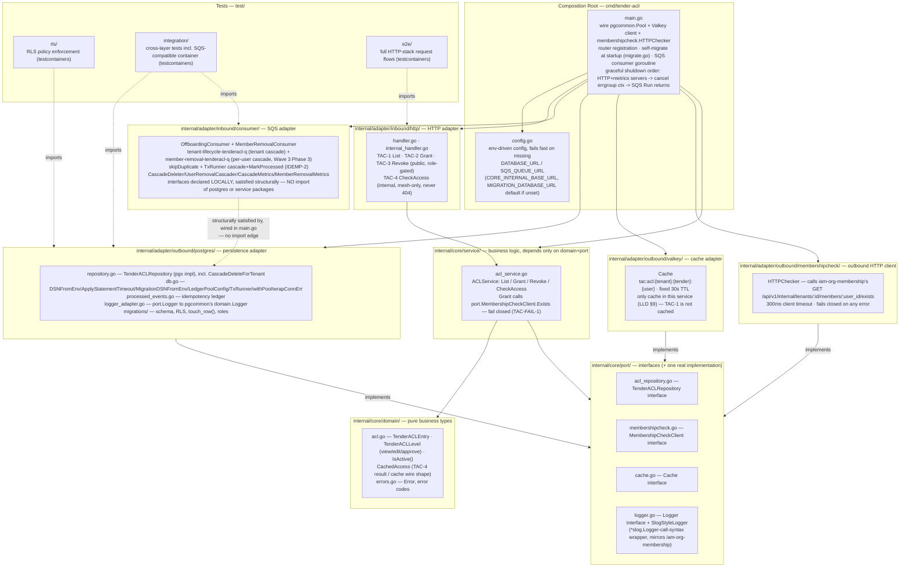
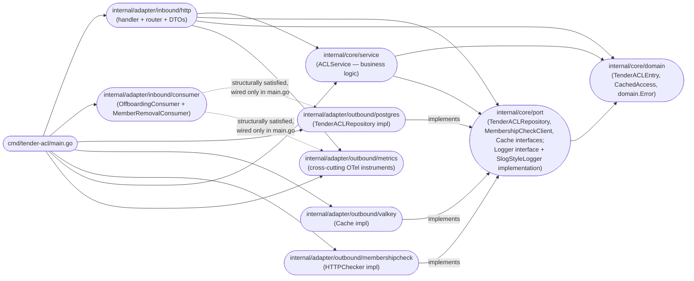
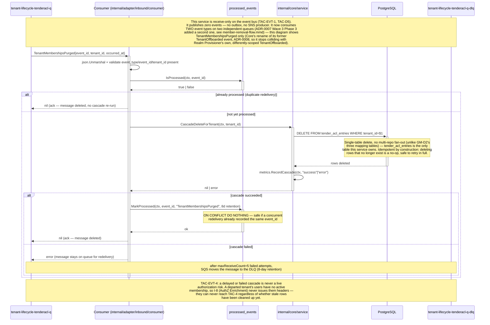
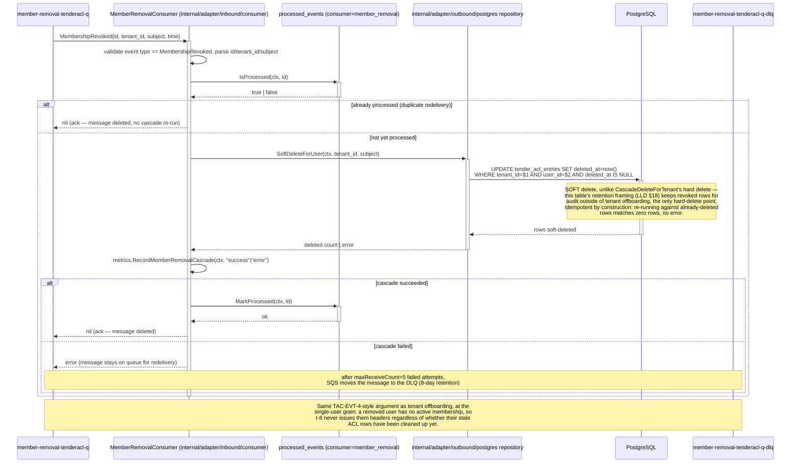
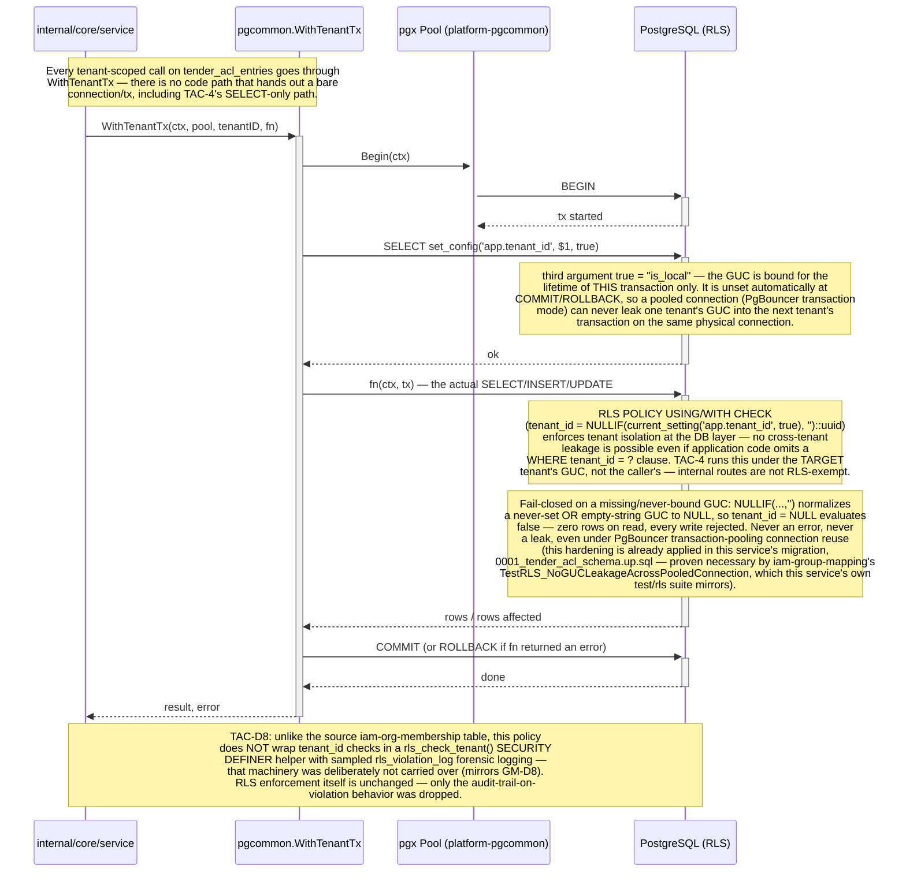

# Architecture

## Mental model

One table (`tender_acl_entries`), four endpoints, one synchronous outbound dependency, two inbound
async subscriptions (tenant-offboarding, and per-user-removal since ADR-0007 Wave 3 Phase 3), zero
outbound events. This service exists to run standalone just long enough to
be safely decoupled from `iam-org-membership`'s database — it is explicitly disposable, slated for
reabsorption into the Tender Service at Wave 4 (`docs/lld/iam-lld-tender-acl-service.md` §25, ADR-0007 Option
D). Every design choice below optimizes for "correct and cheap to delete later," not "built to
last."

## Layer model — Clean Architecture / Ports-and-Adapters

This service uses the same Clean Architecture / Ports-and-Adapters split its siblings
(`iam-org-membership`, `iam-catalog-admin`, `iam-group-mapping`) use:
`internal/core/{domain,port,service}` + `internal/adapter/{inbound,outbound}`.

**History:** it originally shipped with a deliberately flat, near-literal-lift layout
(`docs/lld/iam-lld-tender-acl-service.md` §6, decision TAC-D1) — the reasoning at the time was that this service
is explicitly interim (Wave 4 folds it away entirely, ADR-0007 Option D), so minimizing abstraction
seemed cheaper than building layering that would just be unwound in a future merge. That decision
was later reversed to bring this service in line with every sibling IAM service's structure and
tooling (shared `go-arch-lint` conventions, the same mental model for anyone moving between repos) —
see `CHANGELOG.md` for when. The interim/disposable framing in the Mental Model section above is
still accurate; only the package layout changed, not the "don't over-engineer, this gets folded into
the Tender Service eventually" posture.


> Source: [`docs/architecture/mermaid/layer-model.mmd`](docs/architecture/mermaid/layer-model.mmd)

The three pinned shared libraries (`platform-gincommon`, `platform-events`, `platform-pgcommon`)
are fetched as private `github.com/BCBP-SOLUTIONS-FZC-LLC/*` Go modules — not vendored locally — the
same convention iam-org-membership and iam-user-profile use.

## Package dependency graph


> Source: [`docs/architecture/mermaid/package-dependencies.mmd`](docs/architecture/mermaid/package-dependencies.mmd)

**The dependency rule (enforced by `.go-arch-lint.yml`):** `core/domain` has no internal
dependencies; `core/port` depends only on `domain`; `core/service` depends only on `domain`+`port`;
adapters depend on `core` (never on each other directly). `internal/adapter/inbound/consumer` takes
Interface Segregation one step further: it declares its own minimal interfaces (`CascadeDeleter`,
`IdempotencyStore`, `CascadeMetrics`, `UserRemovalCascader`, `MemberRemovalMetrics`) locally, narrow
slices of `port.TenderACLRepository` and the metrics adapter's method set, rather than depending on
the full port interface or importing the outbound adapters directly — `main.go` wires the concrete
`*postgres.TenderACLRepository`/`*metrics.Metrics` into those narrow interfaces purely via Go's
structural typing, so `go-arch-lint` sees no import edge from `adapter/inbound/consumer` to
`adapter/outbound/postgres` at all.

## Request flow

```mermaid
sequenceDiagram
    participant Client
    participant GW as API Gateway
    participant MW as gincommon middlewares
    participant H as Gin Handler (internal/adapter/inbound/http)
    participant MC as port.MembershipCheckClient
    participant Core as iam-org-membership
    participant DB as PostgreSQL (RLS)
    participant Cache as Valkey (tac:acl)

    Client ->>+ GW: HTTP request (JWT already validated upstream)
    GW ->>+ MW: inject X-Tenant-Id / X-User-Id / X-Tenant-Roles headers
    Note over MW: otelgin.Middleware — OTel span<br/>RequestContextMiddleware — parse headers into RequestContext<br/>Recovery — panic -> 500 JSON, never crashes the process<br/>Logger — structured request log<br/>MetricsMiddleware — gincommon's own http_requests_total / _duration_seconds (passthrough, not a tender_acl_* duplicate)

    alt public admin endpoint (TAC-1 List / TAC-2 Grant / TAC-3 Revoke)
        MW ->>+ H: c.Next()
        Note over H: 403 insufficient_role unless caller holds<br/>tender_admin / tenant_admin / tenant_owner for the path tenant
    else internal authorization check (TAC-4)
        MW ->>+ H: c.Next()
        Note over H: no role check — mTLS-only network path,<br/>tenant isolation still enforced by RLS alone,<br/>runs under the TARGET tenant's GUC
    end

    alt TAC-2 Grant
        H ->>+ MC: Exists(ctx, tenantID, userID)
        MC ->>+ Core: GET /api/v1/internal/tenants/:id/members/:user_id/exists
        Core -->>- MC: {"active": true|false, "tenant_membership_id"?}
        alt Core unreachable / timeout (300ms budget)
            MC -->>- H: error
            H -->> Client: 503 core_unavailable (fail closed — no row written, TAC-FAIL-1)
        else active: false
            MC -->>- H: false, nil
            H -->> Client: 422 grantee_not_active_member
        else active: true
            MC -->>- H: true, membershipID, nil
            H ->>+ DB: INSERT tender_acl_entries (WithTenantTx)
            DB -->>- H: row, or 409 duplicate_grant on uq_tae_active_entry
            H ->> Cache: DEL tac:acl:{tenant}:{tender}:{user} (best-effort, post-commit)
            H -->> Client: 201
        end
    else TAC-3 Revoke
        H ->>+ DB: UPDATE ... SET deleted_at=now() WHERE ... AND deleted_at IS NULL<br/>AND record_version=$4 (WithTenantTx)
        Note over DB: Caller must send its last-read record_version in the request<br/>body (LLD §11.3/§12.1). Zero rows affected (stale version, already<br/>revoked, or no such row) -> 409 optimistic_lock_conflict.
        DB -->>- H: rows affected, or 409 optimistic_lock_conflict
        H ->> Cache: DEL tac:acl:{tenant}:{tender}:{user} (best-effort, post-commit)
        H -->> Client: 204
    else TAC-1 List
        H ->>+ DB: SELECT ... WHERE tenant_id=$1 AND tender_id=$2 (WithTenantTx, not cached)
        DB -->>- H: rows
        H -->> Client: 200
    else TAC-4 CheckAccess
        H ->>+ Cache: GET tac:acl:{tenant}:{tender}:{user}
        alt cache hit
            Cache -->>- H: cached {has_access, access_level, expires_at}
        else cache miss
            Cache -->>- H: miss
            H ->>+ DB: SELECT ... WHERE deleted_at IS NULL AND (expires_at IS NULL OR expires_at > now())
            DB -->>- H: row or none
            H ->> Cache: SET tac:acl:{tenant}:{tender}:{user}, TTL 30s
        end
        H -->> Client: 200 {has_access, access_level, expires_at} — never 404
    end

    H -->>- MW: response (200/201/204/403/422/503)
    MW -->>- GW: return
    Note over MW: gincommon's http_requests_total / _duration_seconds recorded<br/>OTel span ended · structured log line written
    GW -->>- Client: HTTP response
```
> Source: [`docs/architecture/mermaid/request-flow.mmd`](docs/architecture/mermaid/request-flow.mmd)

## Event consumer flow


> Source: [`docs/architecture/mermaid/event-consumer-flow.mmd`](docs/architecture/mermaid/event-consumer-flow.mmd)

### Per-user-removal cascade flow (ADR-0007 Wave 3 Phase 3)

Structurally identical to the tenant-offboarding flow above — independent queue, independent DLQ,
independent `processed_events` consumer scope, independent metric — with a soft-delete instead of
a hard delete, and one extra field (`subject`, the removed user's id) read from the envelope:


> Source: [`docs/architecture/mermaid/member-removal-flow.mmd`](docs/architecture/mermaid/member-removal-flow.mmd)

### Schema dependency on the producer

This service has no Glue Schema Registry integration (LLD §10.5 — explicit, documented exemption
for `TenantMembershipsPurged`, extended by this task to `MembershipRevoked`). `api/asyncapi.yaml`'s
`TenantMembershipsPurged` and `MembershipRevoked` messages each carry an
`x-consumer-schema-dependency` block documenting the exact shape each consumer depends on, since no
automated tooling here would otherwise catch a breaking upstream change to `iam-org-membership`'s
publish path. If a producer ever deprecates either event in favor of a replacement, this service
needs a new consumer for it before the producer's retire-after deadline — track any such notice
manually (there is no CI check that surfaces it).

**Open governance gap** (not resolved by this task): `MembershipRevoked`
has not been run through `iam-org-membership`'s `platform-schemagov` pipeline, and that repo's own
`api/asyncapi.yaml` (its real schema source of truth) does not yet document the event. The event
works correctly today — verified end-to-end against real Postgres in both repos' test suites — but
this specific governance step is genuinely incomplete, flagged explicitly rather than silently
skipped.

## Data model overview

Database `tender_acl` on RDS PostgreSQL. **One table**, `tender_acl_entries` (`view`/`edit`/`approve`
via `tender_acl_level`), plus `processed_events` (RLS-exempt, global, 8-day retention, composite PK
`(event_id, consumer)` so the two cascade consumers dedup independently). Both `ENABLE ROW LEVEL
SECURITY` + `FORCE ROW LEVEL SECURITY` (two separate `ALTER TABLE` statements — `FORCE` is what
makes the policy apply even to the table owner) + `REVOKE ALL FROM PUBLIC` + a `tenant_isolation`
policy on `app.tenant_id` apply only to `tender_acl_entries` — `processed_events` is not
tenant-scoped data at all. `record_version` is bumped by the shared `touch_row()` `BEFORE UPDATE`
trigger, guarded by `WHEN (OLD.* IS DISTINCT FROM NEW.*)` so a no-op write never spuriously advances
the version. `uq_tae_active_entry` (a partial unique index, `WHERE deleted_at IS NULL`) enforces at
most one active grant per `(tenant, tender, user)` triple — the same index a revoked grantee's
re-grant relies on being able to insert past. Since this service has never been deployed, the schema
is one consolidated migration (`0001_tender_acl_schema`) rather than an incremental history with
dead expand/contract steps to carry forward.

**Two Postgres roles:**

| Role | Grants | Used by |
|---|---|---|
| `tender_acl_app` | Normal DML, RLS-scoped, **never** `BYPASSRLS` | The running server pod's app pool |
| `tender_acl_migrator` | `BYPASSRLS`, DDL | The self-migration step at startup (`RunMigrations`) only — there is no separate reconciler/cross-tenant job in this service to share it with |

Two composite foreign keys were lost in the decomposition, replaced by two different mechanisms
depending on what each one actually guaranteed — unlike `iam-org-membership`'s own lost cross-database
FKs, which are uniformly replaced by a read-through-cache existence check: `fk_tae_tenant`'s
`ON DELETE CASCADE` is replaced by the async tenant-offboarding cascade (§"Event consumer flow"
above, TAC-D7), since a cascade-delete has no write-time urgency; `fk_tae_tenant_membership` is
replaced by the synchronous, grant-time-only `membershipcheck` call (TAC-D2), since that one *is* a
write-time integrity guarantee — a grant must not be written for a non-member at all, not merely
cleaned up eventually.

Full table catalogue, RLS policy SQL, and every trigger/index/role invariant is in
[`.claude/database.md`](.claude/database.md).

## Cache strategy

```mermaid
flowchart TD
    subgraph keys["Cache Key Namespace  (Valkey)  —  the ONLY cache in this service (LLD §9)"]
        k1["tac:acl:{tenant}:{tender}:{user}\n→ {has_access, access_level, expires_at}\nTTL: 30s, no jitter"]
    end

    subgraph check["TAC-4 — Internal Authorization Check  (GET /internal/.../acl/:user_id)"]
        A1([mTLS-only caller, no role check]) --> A2{"tac:acl:{tenant}:{tender}:{user}\ncache hit?"}
        A2 -- yes --> A3["Return cached {has_access, access_level, expires_at}\nNever 404, regardless of hit/miss"]
        A2 -- no  --> A4["SELECT tender_acl_entries\nWHERE deleted_at IS NULL AND\n(expires_at IS NULL OR expires_at > now())"]
        A4 --> A5["SET tac:acl:{tenant}:{tender}:{user}, TTL 30s"]
        A5 --> A6["Return {has_access, access_level, expires_at}"]
    end

    subgraph list["TAC-1 — List  (GET .../acl, admin-gated)"]
        L1([role-checked caller]) --> L2["Always reads live from Postgres\nNOT cached — low-frequency, admin-gated read"]
    end

    subgraph write["Write / Invalidation Path  (TAC-2 Grant, TAC-3 Revoke)"]
        W1([Grant or Revoke, single-row WithTenantTx]) --> W2{Committed?}
        W2 -- no → rollback --> W3[No cache operation\ntransaction/membership-check error returned]
        W2 -- yes --> W4["DEL tac:acl:{tenant}:{tender}:{user}\nAFTER commit — deliberately DELETE not\nUPDATE, so a mid-write process death\nnever serves a stale write-through value"]
        W4 --> W5["Failed DEL is logged, not fatal (TAC-FAIL-2)\nNext TAC-4 read past the 30s TTL\nre-populates from the source of truth regardless"]
    end

    subgraph offboard["Tenant Offboarding Cascade"]
        O1([TenantMembershipsPurged consumed]) --> O2["DELETE FROM tender_acl_entries\nWHERE tenant_id=$1"]
        O2 --> O3["No cache invalidation performed here —\nany cached tac:acl:* entries for the\noffboarded tenant simply expire within 30s"]
    end

    note1["The 30s TTL is the entire staleness budget in this service.\nLLD §17.4 end-to-end chain: grant -> TAC-4 has_access:true (cached)\n-> revoke -> TAC-4 MAY still return the pre-revoke cached value until\nthe DEL lands or the 30s TTL expires, whichever is first — the DEL\nis synchronous with the revoke commit, so in practice this window is\nthe time between commit and the DEL call, not the full 30s."]

    note2["Cache failure mode (TAC-FAIL-2): Valkey down -> TAC-4 falls\nthrough to Postgres on every call (degraded latency, not outage).\n/readyz reports cache degraded but the pod stays in service — writes\nproceed normally, a failed DEL is logged and swallowed."]
```


> Source: [`docs/architecture/mermaid/cache-strategy.mmd`](docs/architecture/mermaid/cache-strategy.mmd)

## Row-Level Security (RLS) and GUC injection


> Source: [`docs/architecture/mermaid/rls-guc-flow.mmd`](docs/architecture/mermaid/rls-guc-flow.mmd)
> (Note: corrected here to reflect that the `NULLIF(...,'')` hardening is already implemented in
> this service's migration, not a future TODO — the source `.mmd` file's phrasing was written
> conditionally before the migration's final form was confirmed.)

## Observability

- **Metrics** (Prometheus, LLD §14.2):
  - Generic per-request HTTP metrics are platform-gincommon's own —
    `http_requests_total{method,route,status_class,error_class}`,
    `http_request_duration_seconds{method,route,status_class,error_class}` — passed through
    as-is (ObservabilityMiddlewares' MetricsMiddleware) rather than duplicated under a
    `tender_acl_*` name. This service is not yet deployed, so this is the only naming it has
    ever shipped with — see CHANGELOG.md.
  - Business-level metrics keep the `tender_acl_*` prefix, since gincommon has no equivalent:
    `tender_acl_writes_total{op,result}`,
    `tender_acl_grant_checks_total{status}` (`active`/`not_active`/`unavailable`),
    `tender_acl_check_calls_total{status}` (`has_access`/`no_access`),
    `tender_acl_cache_hits_total{key}` / `tender_acl_cache_misses_total{key}`,
    `tender_acl_tenant_offboarding_cascade_total{result}`,
    `tender_acl_member_removal_cascade_total{result}`,
    `tender_acl_unexpected_event_type_total{queue,event_type}` (mirrors iam-org-membership's
    `iam_unknown_event_acknowledged_total` — makes an unrecognized delivery observable instead of
    only logged, see CHANGELOG.md).
  - Both SQS consumers' own metrics are platform-events' own — `events_consumed_total{queue,
    event_type,status}`, `events_consume_duration_seconds{queue,event_type}`, and, notably,
    `sqs_receive_errors_total{queue}`/`sqs_delete_errors_total{queue}`/
    `sqs_visibility_extension_errors_total{queue}` (the library's own docs flag the latter two as
    *causing* duplicate delivery when non-zero — exactly the failure mode `processed_events`
    exists to survive). Activated by a single `events.InitWithRegisterer("tender-acl",
    buildVersion, gincommon.MetricsRegisterer())` call in `main.go` — the SQS consumer internals
    already compute these on every message regardless; they no-op until this call runs once.
- **Tracing**: OTel Go SDK, W3C Trace Context, bootstrapped at process start via
  `gincommon.InitTracing` (same order as `iam-org-membership` / `iam-realm-provisioner`). Span shape:
  `inbound.http → service.ACLService.<method> → outbound.postgres` (+
  `outbound.membershipcheck` only on Grant, + `tac:*` cache read/DEL spans on
  CheckAccess/Grant/Revoke).
- **Logging**: a single Zap-backed logger built via `platform-gincommon/pkg/logger.NewLogger`
  (`cmd/tender-acl/main.go`), matching `iam-user-profile`'s/`iam-org-membership`'s identical
  convention — every log line in this process (HTTP request logs, pgcommon slow-query/migration
  logs, SQS warnings, the service/consumer layers) flows through it, not a local slog JSON handler.
  `internal/core/port.SlogStyleLogger` preserves the existing `*slog.Logger`-style call syntax on
  top of that shared sink; `*Context` calls carry `trace_id` automatically, and both consumers bind
  `tenant_id`/`event_id` once per `Handle` call. Cache/DB best-effort failures (cache invalidation,
  cache populate) are logged at `WARN`, never escalated to a caller-visible error.
- **Dashboards**: "Tender ACL" Grafana folder — Requests & Writes; Grant-Time Membership Check;
  Tenant-Offboarding Cleanup (LLD §14.4).
- **Alerts** (LLD §14.5): `/readyz` failing >5min → SEV-2; TAC-4 error rate >10%/5min → SEV-2; Core
  (membershipcheck) unreachable during TAC-2 sustained >15min → SEV-3; DLQ depth>0 → SEV-3;
  `tender_acl_unexpected_event_type_total` sustained nonzero >30min → ticket (not paged).

## Concurrency and failure domains

- **TAC-2/TAC-3 writes**: single-row `WithTenantTx`, no cross-row/cross-table consistency
  concern — this service owns exactly one domain table.
- **TAC-2's one synchronous outbound call** (`port.MembershipCheckClient.Exists`) fails **closed**:
  any network error, timeout, or non-2xx response blocks the grant (`503 core_unavailable`), never
  defaults to allowing it (TAC-FAIL-1).
- **TAC-1/TAC-3/TAC-4 have zero synchronous cross-service dependency** — only TAC-2 does
  (TAC-FAIL-3).
- **Own-DB/cache down**: `503 dependency_unavailable` on any route that needs Postgres; Valkey down
  degrades TAC-4 to direct-Postgres reads (higher latency, not an outage) — never an incorrect
  answer served past the 30s cache TTL (TAC-FAIL-2).
- **Tenant-offboarding cascade**: idempotent by construction (repeat `DELETE WHERE tenant_id=$1` is
  a safe no-op); a delayed or even indefinitely-failed cascade is never a live authorization risk
  (TAC-EVT-4) — see the event-consumer-flow diagram's closing note.

## Key invariants

**Decision register (TAC-D1–D13, `docs/lld/iam-lld-tender-acl-service.md` §26):**

| # | Decision |
|---|---|
| TAC-D1 | **Superseded.** Originally a deliberately minimal, near-literal-lift flat package layout — because explicitly interim. Later reversed to adopt the same Clean Architecture layering every sibling service uses (see "Layer model" above and `CHANGELOG.md`) — the interim/disposable framing itself is unchanged, only the package structure. |
| TAC-D2 | Lost composite FK replaced by a synchronous grant-time-only membership check, behind a swappable interface for cheap Wave-4 repoint/delete. |
| TAC-D3 | TAC-1/TAC-4 need no membership join, no cross-service call — only TAC-2 does. |
| TAC-D4 | FK loss is low-risk because the active-grant predicate (TAE-3) was never conditioned on live membership status; AuthZ Enrichment's I-8 gate provides read-time safety independently. |
| TAC-D5 | No new event introduced for grant/revoke — preserves the source's "no bus event" posture. |
| TAC-D6 | Wave-4 entry criteria written down now, per ADR-0007 Action Item 7 (LLD §25). |
| TAC-D7 | Second FK loss (`fk_tae_tenant ON DELETE CASCADE`) replaced by an async SQS subscription, not a second synchronous check — mirrors Wave-2's GM-D2. |
| TAC-D8 | No `rls_check_tenant()`/`rls_violation_log` forensic-logging wrapper — deliberate scope reduction, mirrors Wave-2's GM-D8. |
| TAC-D9 | This v2.0 LLD revision adopts the canonical section template and repoints broken cross-references from earlier drafts; all requirement IDs preserved, only relocated. |
| TAC-D10 | A second inbound event, `MembershipRevoked` on its own queue (`member-removal-tenderacl-q`), soft-deletes (not hard-deletes) a removed user's rows within the affected tenant — a second, independent asynchronous cascade (ADR-0007 Wave 3 Phase 3), not a discriminated payload on the tenant-offboarding queue, so each cascade's failure mode stays independently observable. |
| TAC-D11 | The grant-time membership-check response contract is `{"active": true, "tenant_membership_id": "<uuid>"}` / `{"active": false}`, not a bare boolean — required because `tenant_membership_id` is `NOT NULL` and is the one field replacing the lost composite FK. |
| TAC-D12 | Catch-up, not a new decision: this document's event names were brought in line with `iam-org-membership`'s ADR-0008 rename (`TenantOffboarded`→`TenantMembershipsPurged`, `TenantMembershipRemoved`→`MembershipRevoked`) after the service's own code and `api/asyncapi.yaml` had already shipped against the new names. |
| TAC-D13 | TAC-1 (list) is paginated (`?limit=`/`?offset=`, default 100, hard ceiling 500) — added after a production-readiness audit found an unbounded response was a real gap, not merely theoretical; the underlying query's index usage is unaffected. |

**Event invariants (TAC-EVT-1–6)** are described in full in `docs/lld/iam-lld-tender-acl-service.md` §10.6;
**operational/failure invariants (TAC-FAIL-1–3)** are covered in the Concurrency/Failure section
above.

## Deployment

### Container image — one binary

Unlike `iam-org-membership` (separate server + reconciler binaries), this service ships **one**
binary, `/tender-acl` (`cmd/tender-acl`), running both the HTTP server (TAC-1..4) and both SQS
consumers (tenant-offboarding + per-user-removal) in-process via a single `errgroup` — there is no
reconciler binary and no K8s CronJob in this chart at all (§"What this service deliberately does not
have").

Two-stage `Dockerfile`: `golang:1.26.6-bookworm` builder (digest-pinned), runtime is
`gcr.io/distroless/static-debian12:nonroot` (no shell, non-root UID 65532) — only the one compiled
binary is copied in, which is why `docs/swagger` (blank-imported for its `init()`-time Swagger
registration) and `api/asyncapi.yaml` (compiled in via `//go:embed`) both have to survive into the
build context rather than being read from disk at runtime. `.dockerignore` excludes `docs/lld/` and
`docs/architecture/` specifically — **not** `docs/` wholesale, which previously broke every build by
also stripping `docs/swagger` (fixed during a production-readiness audit; see `CHANGELOG.md`).

`hadolint`-clean (`# hadolint ignore=DL3008` suppresses the one expected finding — `apt-get
install` intentionally tracks Bookworm's rolling security updates rather than pinning a package
version, since the base image itself is already digest-pinned). The builder stage's final `COPY
--link . .` decouples that layer from earlier ones for better cache reuse, matching
`iam-org-membership`'s identical builder-stage copy. The runtime stage re-declares `ARG
BUILD_VERSION` (ARGs don't cross a `FROM` boundary) and sets it as both `ENV BUILD_VERSION` and the
`org.opencontainers.image.revision` OCI label — `cmd/tender-acl/main.go`'s `getEnv("BUILD_VERSION",
buildVersion)` can read it at runtime now, not just via the `-ldflags -X main.buildVersion=...`
compile-time embed.

### Helm chart

`deploy/helm/tender-acl/` renders one `Deployment`, no `CronJob`s. HPA: `minReplicas: 2` /
`maxReplicas: 10`, CPU 70% / memory 80% (optionally request-rate-based instead, via
`autoscaling.targetRPSPerReplica` + `deploy/monitoring/prometheus-adapter-rule.yaml`). PDB
`minAvailable: 1`. `terminationGracePeriodSeconds: 30` — matches `main.go`'s shutdown ordering: HTTP
`Shutdown` → metrics-server `Shutdown` → both SQS consumers' `Stop()` → `pgPool.DrainAndClose`
(`Close()` deferred as a safety net). NetworkPolicy is scoped to the `envoy-gateway-system` ingress
namespace plus a `monitoring`-namespace `prometheus` scrape on the metrics port — the same shape
`iam-group-mapping`'s own chart uses, plus one egress rule that sibling doesn't need: outbound to
`iam-org-membership` itself for the `membershipcheck` call, this service's one synchronous outbound
dependency.

### Migration safety

Since this service has never been deployed, the schema is one consolidated `0001_tender_acl_schema`
migration rather than an incremental history with dead expand/contract steps to carry forward. The
pod self-migrates at startup (`RunMigrations`, using `MIGRATION_DATABASE_URL`'s `BYPASSRLS`
`tender_acl_migrator` role) — there is no separate migrate Job in this chart. `PG_BOUNCER_MODE` is
forced `true` unconditionally in code (not env-driven), since transaction-scoped GUC binding is
required for RLS correctness regardless of deployment topology, not a tunable to get wrong via
config.

## Testing strategy

- **Unit** (colocated `*_test.go` throughout `internal/`, no Docker) — fake/mock implementations of
  every port (`fakeRepo`, `fakeChecker`, `fakeCache`) drive `ACLService`/`Handler` business logic and
  every `domain.Error` code's HTTP-status mapping without a database; `cmd/tender-acl/config_test.go`
  covers `loadConfig`'s fail-fast behavior (missing/malformed required env vars) and `getEnvInt`.
- **RLS** (`test/rls/`, `-tags=rls`, testcontainers-go, real Postgres, full migration suite) — the
  canonical suite: missing-GUC fail-closed (zero rows, never an error), cross-tenant read/write/update
  denial, and the pooled-connection no-leak case (`TestRLS_NoGUCLeakageAcrossPooledConnection`,
  proving the `NULLIF(...,'')` hardening in the migration is load-bearing, not decorative).
- **Integration** (`test/integration/`, `-tags=integration`, testcontainers — real Postgres + Valkey +
  an SQS-compatible container) — both cascade consumers' idempotency (duplicate delivery is a no-op)
  and unknown-event-type handling against a real database; the membership-check fail-closed path;
  the optimistic-lock conflict on revoke; cache hit/miss round trips against real Valkey.
- **E2E** (`test/e2e/`, `-tags=e2e`) — full HTTP-stack request flows (grant → check → revoke → check)
  against the real `NewRouter`, the same function `cmd/tender-acl/main.go` calls, so the e2e suite
  and production share one route table by construction.
- **Smoke** (CI only) — two layers: `.github/scripts/smoke-tests.sh` (image-size gate plus a
  startup-gate check that the CI-built image exits non-zero on missing required env vars) and
  `.github/scripts/smoke-http-test.sh` (added during a production-readiness audit — boots the actual
  built image against real Postgres/Valkey/LocalStack via `docker-compose.yml` and issues real
  `/readyz`/`/healthz`/TAC-4 requests; the first smoke test alone never proved the shipped image
  actually boots and serves traffic).

Coverage is measured over unit+integration+rls merged via `make test-ci`/`make cover-func`.
`.github/scripts/coverage-gate.sh` enforces `COVERAGE_THRESHOLD` (default **85%**, raised from an
initial 70% baseline once real merged coverage was independently measured at 91.6% — this service
sits on a live authorization-decision path, TAC-4, so the floor was raised to match rather than left
at a starting-baseline number).

## Threat model (brief)

- **Cross-tenant data access**: primary defense is RLS (fail-closed on missing GUC); secondary
  defense-in-depth is the handler-layer `requireSameTenant` check comparing the gateway-injected
  tenant against the path parameter. Both must independently fail for a cross-tenant leak to occur.
- **Grant-time authorization bypass**: mitigated by failing closed on any membershipcheck error
  (never fail-open) — an attacker cannot force a grant to succeed by causing `iam-org-membership`
  to become unreachable.
- **TAC-4 is mesh-only**: no public ingress, no JWT/role check — the entire trust boundary is
  network-layer (mTLS + NetworkPolicy), same posture as every other IAM internal route in this
  platform.
- **Incidental PII in `reason`**: free-text admin field, not validated for PII content, treated as
  opaque — same posture as similar free-text fields elsewhere in this platform. Removed only via
  tenant-offboarding cascade or explicit revoke, not a dedicated GDPR delete path.

## What this service deliberately does not have

| Missing (vs. sibling services) | Why |
|---|---|
| A reconcile algorithm (unlike `iam-group-mapping`'s full-replacement diff) | TAC-2/TAC-3 are simple single-row grant/revoke operations, not a bulk-replace resource. |
| An outbound event publisher / outbox table | TAC-EVT-1/TAC-D5 — no ACL event exists in the platform's catalogue and this extraction adds none. |
| A shared audit-log table | No such mechanism exists anywhere in this platform yet — structured logging is the only durable write record today. |
| A GDPR per-user delete path | A departed user's row goes inert (unreachable via TAC-4 once membership lapses, TAC-D4), not deleted, unless the whole tenant offboards. |
| `rls_check_tenant()`/`rls_violation_log` forensic logging | TAC-D8 — deliberately dropped, mirrors GM-D8. RLS enforcement itself is unaffected. |
| A "Consumer conformance checklist" section (`iam-org-membership`'s ARCHITECTURE.md has one) | That section is guidance for services subscribing to *this* service's published events — this service publishes zero (TAC-EVT-1), so there is no downstream consumer contract to write one for. |
| A "Schema lifecycle" section (`iam-org-membership`'s ARCHITECTURE.md has one, covering its Glue Schema Registry integration) | Glue governance only applies to schemas a service *produces*; this service is consume-only, and its consumer-side schema dependency is covered instead by "Schema dependency on the producer" above. |

## Developer tools

`go-arch-lint` (`.go-arch-lint.yml`) enforces the one dependency rule described above.
`golangci-lint` (`.golangci.yml`, invoked via `make lint`) covers everything else. `go vet`/`gofmt`
run in CI (`validate-quality.yml`) alongside both.

## Session-specific decisions

Unlike `iam-org-membership`'s own ARCHITECTURE.md, this section is intentionally short: every
judgment call made during this service's build-out is already recorded at its natural point of
impact — the LLD's Decision Register (TAC-D1–D13, `docs/lld/iam-lld-tender-acl-service.md` §26,
cross-referenced from "Key invariants" above) for design decisions, and its Revision History (same
document, top of file) plus `CHANGELOG.md` for the fix-level detail (what was found, why, what
changed) a production-readiness audit or a shared-library-alignment pass produced. Duplicating that
material here would just be a second copy to keep in sync; this document instead points at it.

**This document's own "Key invariants" table above is kept in sync with the LLD's register** (both
currently run to TAC-D13) — if the two ever appear to disagree, treat the LLD's register as
authoritative, since this document is a navigational summary of it, not an independent source of
truth.

## Documentation assets

Mermaid source files backing every diagram in this document live under
`docs/architecture/mermaid/` — see `docs/architecture/README.md` for the full index and rendering
instructions.

## API/event contract doc surfaces

Two dev-tool routes, both gated by `DocsConfig`/`docsAuthMiddleware` the same way (dev-only by
default; opt-in + bearer-token-gated in production via `DOCS_ENABLED`/`DOCS_AUTH_TOKEN`), wired in
`registerDocsRoutes` (`internal/adapter/inbound/http/router.go`):

- **`GET /swagger/*any`** — Swagger UI over the OpenAPI spec generated by `make swag` from handler
  `// @…` annotations (`docs/swagger/`).
- **`GET /asyncapi`** / **`GET /asyncapi.yaml`** — a server-rendered HTML catalog for
  `api/asyncapi.yaml`, and the raw spec itself, both served by
  `internal/adapter/inbound/http/asyncapi.go`. Ported verbatim (renderer logic unchanged) from
  `iam-user-profile`'s identical viewer, which is entirely YAML-driven — it walks
  `components.messages`/`components.schemas` directly rather than a hardcoded name list, so it
  needed no changes to render this service's own two-message, zero-`published`-message spec
  correctly. One adaptation beyond the source spec's own `published`/`consumed` tags (added to
  `api/asyncapi.yaml` so the same tag-driven split applies here): the "Published Messages"
  section/sidebar group is omitted entirely rather than rendered empty, since this service
  publishes zero events (TAC-EVT-1) — `iam-user-profile`'s own viewer always renders both headings
  because it always has at least one published message.
- **The spec is embedded at compile time** (`api/embed.go`, `//go:embed asyncapi.yaml`), not read
  from disk at request time the way `iam-user-profile`'s viewer does — this `Dockerfile`'s final
  stage, like every sibling service's, copies only the compiled binary into the distroless image,
  not the source tree, so a disk-read approach would 404/500 there. Embedding sidesteps the
  problem without a `Dockerfile` change.
