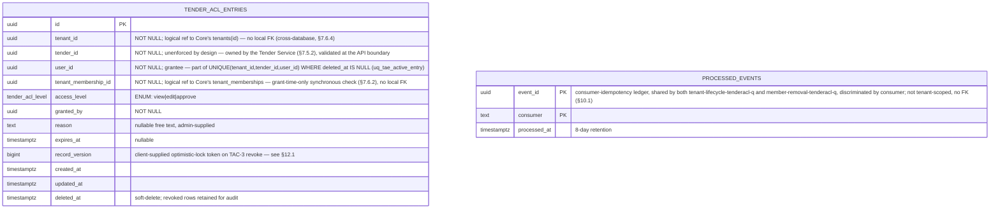
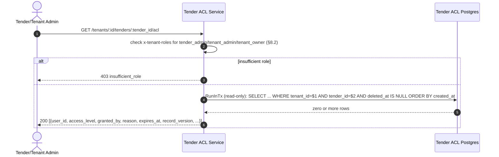
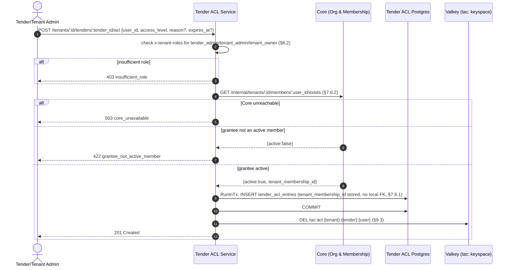
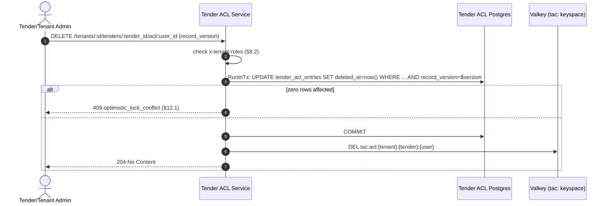
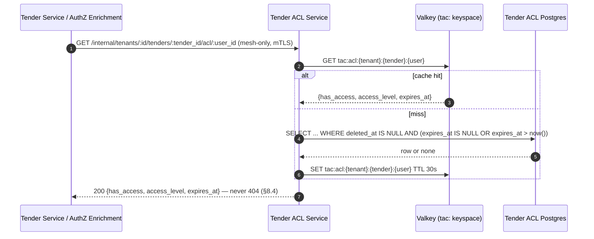

# Tender ACL Service — Low-Level Design

## Tender Management SaaS Platform — IAM Subsystem

| Field | Value |
|---|---|
| Document Type | Low-Level Design (LLD) |
| Service | Tender ACL Service (`tender-acl`) |
| Parent decision | ADR-0007 (Option B now, **Option D next** — this service is explicitly interim) |
| Subsystem | Identity & Access Management |
| Wave | 3 of 3 (do last; realistically independent of Waves 1–2) |
| Version | 2.0 |
| Date | 2026-08-13 |
| Status | Approved for implementation |
| Audience | Tender Service team (I-12 caller, §11.4), AuthZ Enrichment team (I-12 caller), Core Org & Membership engineering (membership-existence callee, §7.6.2), SRE |
| Owner database | RDS PostgreSQL `tender_acl` |

### Revision history

| Version | Date | Notes |
|---|---|---|
| 1.0 | 2026-08-13 | Initial extraction draft against `org_membership_lld_5.md`'s `tender_acl_entries` section and ADR-0007 (Document 1, `01-hld-delta-decomposition.md`). Approved for implementation. |
| 2.0 | 2026-08-13 | **Full restructuring to the canonical section template used by `iam-lld-user-profile v1.md` and `org_membership_lld_5.md`, adapted with the offset this document's own §1–§3 preamble requires** (§4 Document Overview → §20 Appendix — Error Taxonomy), per explicit review request. Added every section the template requires and this document previously lacked in full: **§6.1–6.3** (Shared library dependencies, Dependency rules enforced in CI, Shared library integration scope), **§7** Data Model restructured around a scoped ER diagram plus **7.1–7.5** (Extensions and enums, Tables, **Row-Level Security — new**, Migrations, Triggers), **§9** Caching Design (formalizing the previously inline `tac:acl` cache), **§10.4** AWS Glue Schema Registry (new — stated as an explicit, documented exemption rather than a silent gap), **§11** Key Request Flows (new — sequence diagrams for the grant, revoke, authorization-check, and tenant-lifecycle-cleanup flows), **§13** Security (new — consolidates the former "Relationship with `x-tenant-roles`" and "Authorization model" sections into the canonical layout), and **§14–§20** (Observability, Configuration, Deployment and Scaling, Testing Strategy, GDPR/Data Lifecycle/Compliance, Open Questions and Sign-off Register, Appendix — Error Taxonomy), none of which existed before this revision. No fact, decision, or invariant already recorded in v1.0 was removed — every one of TAC-D1–D7, TAC-EVT-1–5, and TAC-FAIL-1–3 is preserved verbatim, only relocated into the section the canonical template assigns it. Decomposition-specific material with no slot in the canonical template — the migration mechanics and the running decision register — is retained past the template as **§21–§23**, following the same "extend past the template rather than drop content" approach Document 3 (`group-mapping-jit-config-service-lld.md`) used for its own §18–§21. **Cross-document reference repair:** Document 3's own v2.0 renumbering (also dated 2026-08-13) broke this document's three "Document 3 §…" references — flagged by Document 3's own **GM-Q6** as an outstanding follow-up. This revision closes that gap: §7.5.4 and §10.1 now cite Document 3 §4.2.1/GM-D2 and §7.1/GM-EVT-2 respectively (previously §5.1/§9.3 and §12.1), and §22 now cites Document 3 §18 (previously §14). Document 1's (`01-hld-delta-decomposition.md`) own references into this document are unaffected by this revision — this document's stable IDs (TAC-D1–D7, TAC-EVT-1–5, TAC-FAIL-1–3) were not renamed, only relocated, so any external reference using an ID rather than a section number remains valid. |
| 2.1 | 2026-08-19 | **GAP-01 remediation: §6 described a flat package layout that no longer matches the codebase.** The service's package layout was restructured to Clean Architecture / Ports-and-Adapters on explicit request (`CHANGELOG.md`) — `internal/acl` split into `internal/core/{domain,port,service}`; `internal/membershipcheck`/`internal/cache`/`internal/consumer` moved to `internal/core/port` + their `internal/adapter/{inbound,outbound}` equivalents — but this document was not updated at the time, since it lives outside the `iam-tender-acl` repo the restructuring commit touched. This revision brings **§6** (architecture/package tree, §6.1 shared-library versions, §6.2 dependency rules), **§16.2** (repository/package layout), and **§23**'s **TAC-D1** entry in line with the actual, current structure. Per this document's own v1.0→v2.0 precedent, TAC-D1 is marked **superseded** rather than deleted or renumbered — the original reasoning for the flat layout is preserved alongside the record of its reversal. §5.3's citation of TAC-D1 as support for "footprint is deliberately minimal" is repointed to §22, since that framing (interim/disposable, not the package layout) is what TAC-D1 no longer speaks to. No other section's facts, decisions, or invariants are affected. |
| 2.2 | 2026-08-19 | **GAP-02 remediation: this document documented only one inbound event (`TenantOffboarded`), while the service has consumed a second — `TenantMembershipRemoved` on its own queue, `member-removal-tenderacl-q` — since ADR-0007 Wave 3 Phase 3 (`O_AND_M_DELTA.md` §5 Option B), which post-dated this document's v2.0.** The service's own `api/asyncapi.yaml` already documented both correctly; this document did not, for the same reason as GAP-01 — it lives outside the `iam-tender-acl` repo the Phase 3 work touched. New decision **TAC-D10** (§23) records the addition. Updated: **§10.1** (both queues/consumers/DLQs), **§10.3** (two `receive` operations), **§10.5** (TAC-EVT-2/3/4 revised, TAC-EVT-6 added), **§11** (new **§11.5** per-user-removal cleanup flow), **§12.2/§12.3** (idempotency strategy and failure-scenarios table extended), **§14.2–§14.5** (the `tender_acl_member_removal_cascade_total` metric, its dashboard panel, and its DLQ alert), **§15** (config), **§16.3/§16.4** (scaling trigger and staging isolation), **§17.2** (integration-test coverage), **§18.2/§18.4** (GDPR framing — the per-user-removal cascade is a soft-delete, explicitly **not** an erasure path, unlike the tenant-offboarding hard-delete), and **§19** (TAC-Q3 broadened to cover both cascades). No fact, decision, or invariant already recorded for the `TenantOffboarded` path was removed — only extended to cover the second event type alongside it. |
| 2.3 | 2026-08-19 | **GAP-03 remediation: §7.6.2 specified the grant-time membership-check response as bare `{"active": bool}`, while `port.MembershipCheckClient.Exists`/`membershipcheck.HTTPChecker` require `active` and `tenant_membership_id` together.** `tender_acl_entries.tenant_membership_id` is `NOT NULL`, and this document's own code comments (`internal/core/port/membershipcheck.go`) and `IMPLEMENTATION_GAP_ANALYSIS.md` (Discrepancy 3) already flagged this as "a required correction to the LLD, not a silent implementation choice" — this revision makes that correction. **§7.6.2** now specifies `{"active": true, "tenant_membership_id": "<uuid>"}` / `{"active": false}` as the response shape, states the `NOT NULL`-driven reason explicitly, and cross-references `O_AND_M_DELTA.md` §4's full provider-side handler logic. **§11.1**'s sequence diagram updated to show `tenant_membership_id` on the active-grantee response. New decision **TAC-D11** (§23) records the correction — noting explicitly that Document 1 §6.5's own copy of this contract is a separate document, out of scope here, and should be checked for the same gap independently. The related error-code-collapse behavior (`IMPLEMENTATION_GAP_ANALYSIS.md` Discrepancy 4 — `active:false` conflates "never a member" with "found but not active") is an intentional, already-reviewed narrowing, not part of this correction, and is left as this document already describes it. |
| 2.4 | 2026-08-19 | **GAP-05 remediation: §8.4 gave TAC-4's URL with an `/api/v1` prefix (`GET /api/v1/internal/tenants/:id/tenders/:tender_id/acl/:user_id`), contradicting §8.3's catalogue entry and §11.3's sequence diagram, both of which correctly show no prefix.** `IMPLEMENTATION_GAP_ANALYSIS.md` Discrepancy 5 had already identified this as an inconsistency within this document itself — not a second, real route — and confirmed the prefix-less form matches the actual registration (`internal/adapter/inbound/http/router.go`'s `engine.Group("/internal/tenants/:id/tenders/:tender_id/acl")`, no `/api/v1`). §8.4's header and request example corrected to match §8.3; a note added explaining why TAC-4 (mesh-only, mTLS) carries no `/api/v1` prefix while TAC-1/2/3 (gateway-fronted) do. No decision register entry added — this is a documentation correction, not a design decision. |
| 2.5 | 2026-08-19 | **GAP-06 remediation: §7.3's literal RLS policy SQL omitted the `NULLIF(current_setting('app.tenant_id', true), '')` hardening the actual migration (`0003_tender_acl_entries.up.sql`) applies.** `IMPLEMENTATION_GAP_ANALYSIS.md`'s Schema Additions table had already flagged this as an LLD correction, not a silent deviation: under PgBouncer transaction pooling, a reused backend's custom GUC can resolve to `''` (not `NULL`) once the transaction that last bound it ends, and `''::uuid` raises a cast error rather than failing closed to zero rows — proved by `TestRLS_NoGUCLeakageAcrossPooledConnection` (§17.5 Case 5). §7.3's `CREATE POLICY` SQL updated to the hardened form, with an explanatory paragraph on the failure mode it closes; §17.5 Case 5's intro updated to name the test and explain what its step 3 specifically proves. Matches `iam-group-mapping`'s own RLS migration exactly, per the original Gap-3 instruction to do so. No decision register entry added — this documents an already-implemented, already-explained hardening; nothing new was decided. |
| 2.6 | 2026-08-19 | **GAP-07 remediation: §20's error taxonomy table was missing `invalid_request`/400, which `writeError`/`parseUUIDParam` return on a malformed path-parameter UUID (any route) or a malformed/incomplete JSON body (TAC-2/TAC-3).** `internal/core/domain/errors.go`'s own doc comment states its error-code constants match "§20 verbatim" — while adding this row, found the table was also missing `unauthorized`/401 (TAC-2's `granted_by`-resolution failure when the gateway-injected `x-user-id` is missing or invalid), the only other code defined in that file with no corresponding §20 row; added both together rather than leaving the table only partially reconciled. §8.5's status-code summary updated to match; its `200` row's inaccurate "or successful grant/revoke" (TAC-2 returns `201`, TAC-3 returns `204`, neither is `200`) was also corrected while editing that row, since leaving it would have contradicted the two new rows added immediately beside it. No decision register entry — both are pre-existing, already-implemented error codes; nothing new was decided. |
| 2.7 | 2026-08-19 | **GAP-08/GAP-09 remediation (§14.2, Metrics).** GAP-08: confirmed already resolved as a side effect of the GAP-02 remediation — `tender_acl_member_removal_cascade_total{result}` was added to §14.2/§14.4/§14.5 at that time; no further change needed. GAP-09: §14.2 specified a single `tender_acl_cache_hit_ratio{key}` series, which does not match the actual instrumentation — verified against `internal/adapter/outbound/metrics/metrics.go` directly (not taken on the strength of the gap report's own stated shape, which named a `tender_acl_cache_reads_total{result}` counter that does not exist anywhere in this codebase). The service actually implements **two** counters, `tender_acl_cache_hits_total{key}` and `tender_acl_cache_misses_total{key}`, with the ratio computed via PromQL over them rather than instrumented directly — the same convention `iam-catalog-admin` uses for its own cache, and already explained in the metrics code's own comments. §14.2 corrected to list the two real counters and state the PromQL-derivation explicitly; §14.4/§16.3's dashboard-panel and scaling-trigger mentions of "cache hit ratio" are unchanged, since neither claims it is an instrumented series name. |
| 2.8 | 2026-08-19 | **Self-correction of the 2.2 (GAP-02) revision, plus one completeness gap found during a follow-up sweep of `IMPLEMENTATION_GAP_ANALYSIS.md`'s remaining discrepancies (6–10) against this document.** (1) §10.1's "envelope fields consumed" bullet, added in 2.2, incorrectly named the top-level event-ID field `event_id` — the real `platform-events` `events.Envelope[T]` wire format (confirmed against the published module, `IMPLEMENTATION_GAP_ANALYSIS.md` Discrepancy 6) uses `id`; `event_id` is only this service's own `processed_events` ledger column name (§7.2.2), a different thing entirely. Corrected, with an explicit note distinguishing the two so this doesn't reoccur. (2) Discrepancy 10 records that `TenantMembershipRemoved` is emitted from **two** independent producer call sites in `iam-org-membership` — `MembershipService.RemoveUser` and `ProvisioningService.DeleteMember` (I-5, the Keycloak `USER_DELETE` webhook cascade; missing its own emission until caught during Phase 6 prep — Discrepancy 10 itself is an O&M-side fix, not an LLD gap, but the LLD's own description of the trigger was incomplete as a result. §10.1's table and §11.5 updated to name both call sites — this service's consumer already treated `TenantMembershipRemoved` uniformly regardless of producer, so no code change follows, only a documentation completeness fix. **Not fixed here, flagged for separate attention:** Discrepancy 6 also identifies that `api/asyncapi.yaml` (in this repo, not this document) has a stale `TenantOffboardedPayload` schema using nested `event_id`/`event_type` fields instead of the real top-level `id`/`type` — out of scope here since it's a different artifact than this LLD; Discrepancy 7 (schemagov governance incomplete) and 8/9 (Tender Service/AuthZ Enrichment/iam-realm-provisioner infrastructure gaps) are operational completeness items, not LLD-accuracy gaps, and are left to `IMPLEMENTATION_GAP_ANALYSIS.md`'s own tracking. |
| 2.9 | 2026-08-19 | **Full sweep of every remaining section against the current codebase, on explicit request, beyond the nine originally-reported gaps.** Verified accurate as-is (no change): §5 in-scope/out-of-scope boundaries, §7.1 ENUM definition, §7.2.1's full column/index list (byte-for-byte against `0003_tender_acl_entries.up.sql`), §7.5's trigger name, §8.2's role names, §9's cache key/TTL/mechanics, §13.3's validation constants, §19's open questions (none resolved by migration execution), §22. **Found and fixed:** (1) **§7.2.2** specified `processed_events.event_id` as `text`; the actual migration (`0004_processed_events.up.sql`) uses `uuid`, matching `iam-group-mapping`'s convention — the migration's own comment documents this improvement and cites this section by number, confirming the section was simply never updated to match. Corrected the `CREATE TABLE` SQL and the ER diagram's matching field (§7 — which had inherited the same wrong type from this section when originally drawn). (2) **§21 (Migration Plan)** described "Expand / Cut over / Contract" as a forward-looking plan with no execution status, when `MIGRATION_RUNBOOK.md`'s own Phase 1–7 tracking shows most of it has already run: Expand is done; Cut-over is only partially real (of the three named callers, only `iam-authz-enrichment` exists as code — "Tender Service" doesn't exist and "admin tooling" isn't a real repo — and the tenant-offboarding event-routing repoint cannot be executed from any code in this workspace, per Discrepancies 8–9); Contract's code (deleting Core's handlers, dropping `tender_acl_entries`/`tender_acl_level`) has actually run, applied against testcontainers and the local dev database, but never against a real production database, since none exists in this workspace. Rewrote §21 to state this status per step instead of presenting it as entirely prospective, while deferring the full step-by-step detail to `MIGRATION_RUNBOOK.md` rather than duplicating it here. |
| 2.10 | 2026-08-20 | **Two more findings from a three-way `asyncapi.yaml`/Swagger/LLD/code alignment check.** (1) **§6's package tree listed `api/openapi.yaml`**, which does not exist in the repository and is never referenced by `README.md`, `ARCHITECTURE.md`, or `CHANGELOG.md` — this service documents its REST surface entirely via generated Swagger (`docs/swagger/`, `make swag` from handler `@`-annotations), not a hand-maintained OpenAPI file; the tree entry appears to be an uncorrected carry-over from the canonical section template. Corrected to list `docs/swagger/` instead and state explicitly that no separate `api/openapi.yaml` exists. (2) **A real code bug, not a doc-only gap**, found via the same sweep and fixed in the repository (not in this document, since §12.3/§20 already stated the *intended* behavior correctly): `dependency_unavailable`/503 was never actually constructed anywhere in the codebase — a genuine Postgres/Valkey connectivity failure on TAC-1/3/4 silently returned `500`, not the `503` this document (and `IMPLEMENTATION_GAP_ANALYSIS.md`'s error-code table, which had wrongly marked it "✅ verified") claimed. `internal/adapter/outbound/postgres/repository.go` now classifies connectivity errors via a `wrapConnErr` helper (mirroring `iam-user-profile`'s identical one), and TAC-1/3/4's swagger annotations now correctly declare `503`. No change to this document was needed for that fix — its existing claim was already correct; the code has caught up to it. |
| 2.11 | 2026-08-20 | **Three findings from a follow-up sweep of `internal/adapter/outbound/metrics`, `cmd/tender-acl/main.go`, and `deploy/monitoring/` against this document, after a platform-gincommon/platform-pgcommon/platform-events usage audit changed all three.** (1) **§14.2's `tender_acl_requests_total{route,status}`/`tender_acl_request_duration_seconds{route,quantile}` bullets no longer describe any metric this service emits** — a metrics-passthrough change removed this service's own duplicate HTTP request/duration instruments in favor of platform-gincommon's `http_requests_total`/`http_request_duration_seconds` (already recorded, previously unregistered/thrown away), which §14.2's own last bullet ("HTTP request metrics from the shared Gin middleware") already anticipated but the two removed bullets contradicted; corrected to describe the real metric names/labels (`method`/`route`/`status_class`/`error_class` — not `route`/`status` or `route`/`quantile`, neither of which was ever a real label shape even before this change). §14.2 also gains platform-events' own now-activated consumer metrics (`events_consumed_total`, `events_consume_duration_seconds`, `sqs_receive_errors_total`, `sqs_delete_errors_total`, `sqs_visibility_extension_errors_total`) — previously computed by the library's SQS consumer internals on every message but never registered, hence never emitted, on this process's `/metrics`. (2) **§14.1's TAC-4 cache-miss target moves from 20 ms to 25 ms.** Consequence of (1): the SLO-1 recording rule (`deploy/monitoring/slo-rules.yml`) now sources its latency histogram from platform-gincommon's `http_request_duration_seconds`, whose fixed bucket set has no `0.02` boundary (`0.015`/`0.025` bracket it) — `0.025` is the nearest one actually available. Left as a plain number change, not a new open question, since TAC-Q2 (§19) already frames every §14.1 figure as proposed and SRE-unconfirmed. (3) **§16.4's graceful-shutdown claim — pool `DrainAndClose(ctx)`, not a bare `Close()` — was accurate about intent but ahead of the code**: `cmd/tender-acl/main.go` used `Close()` for both Postgres pools until this revision (harmless in practice, since `httpServer.Shutdown`/both consumers' `Stop()` already drain in-flight work before either deferred close ran, but not what was documented). Code now calls `DrainAndClose(ctx)` on both the RLS-bound pool and the `processed_events` pool (the second pool is new since §6.3.2/§7.2.2's most recent update — this document's "the pool" singular is corrected to acknowledge both). §6.3.3 additionally corrected: `tenant-lifecycle-tenderacl-q`'s config (queue URL, region, concurrency, visibility timeout, and more) now loads via `platform-events/pkg/config`'s env helpers rather than a literal `events.SQSConfig{}` + `WithConcurrency` only — `member-removal-tenderacl-q` is unaffected and still uses the literal form, since that helper package has no concept of a second queue. No decision register entry — all three are corrections (two documentation, one code) to a stated intent, not a new design decision. |
| 2.12 | 2026-08-20 | **New capability, not a correction: a browsable HTML viewer for `api/asyncapi.yaml` (`GET /asyncapi`/`GET /asyncapi.yaml`), ported from `iam-user-profile`'s identical viewer, added to this document's §6 package tree and §10.3.** No behavior change to the event contract itself — `api/asyncapi.yaml` gains only `components.tags.published`/`consumed` (both existing operations tagged `consumed`) so the viewer's Published/Consumed split has something to key off; the "Published Messages" section is omitted entirely rather than rendered empty, since this service publishes zero events (TAC-EVT-1). A new `api/embed.go` (`//go:embed`) bakes the spec into the compiled binary rather than reading it from disk at request time — the `Dockerfile`'s final stage copies only the binary into the distroless runtime image, so a disk-read approach (as `iam-user-profile`'s own viewer still uses, unaddressed there) would 404/500 once actually deployed despite working locally. This document does not duplicate the route-gating/config detail already covered in `README.md`/`ARCHITECTURE.md` (§10.3 cross-references them instead). No decision register entry — a developer-tooling addition, not a design decision affecting TAC-1–4 or the two consumer flows. |
| 2.13 | 2026-08-21 | **Structural completeness pass against `iam-lld-user-profile v1.md`'s canonical template, on explicit request: §11 (Key Request Flows) was the one section still short of the template's "one sequence diagram per catalogued endpoint" convention (`iam-lld-user-profile v1.md` §8.8 diagrams all 18 of its endpoints without exception) — TAC-1 (the admin listing endpoint) was covered in §8.3's catalogue and §7.2.3's ownership table, but had no flow of its own anywhere in §11, unlike TAC-2/3/4.** New **§11.1 List flow (TAC-1)** closes that gap: a sequence diagram plus a call-out of a real, previously-undocumented subtlety in the endpoint's own behavior — TAC-1's query filters only `deleted_at IS NULL`, not the fuller TAE-3 predicate TAC-4 evaluates, so a time-expired-but-unrevoked grant still appears in a TAC-1 listing after TAC-4 has already started answering `has_access:false` for it. This is a documentation addition only — verified against `internal/adapter/outbound/postgres/repository.go`'s actual `List` query, not assumed — no behavior changed. Every existing §11 subsection shifted down one position to make room (Grant §11.1→**11.2**, Revoke §11.2→**11.3**, Authorization check §11.3→**11.4**, Tenant-lifecycle cleanup §11.4→**11.5**, Per-user-removal cleanup §11.5→**11.6**); every cross-reference into §11.x elsewhere in this document (the header table's Audience row, §4, §5.3, §8.4, §10.5, §12.2/§12.3, §14.2/§14.4, §17.2, §18.2/§18.4, §19, and **TAC-D10**'s own §23 entry) was updated to match. Per this document's established convention (v2.0's own precedent), earlier revision-history rows above are left untouched — they describe the section numbers that were current at the time each was written, not the numbers valid today. No decision register entry — a structural/documentation-completeness addition, not a design decision. |
| 2.14 | 2026-08-21 | **§10.3 gains a direct link to `api/asyncapi.yaml`, matching `iam-lld-user-profile v1.md` §7.3's identical treatment of its own spec.** §10.3 previously discussed the spec's shape (two `receive` operations, zero `send`) without ever pointing the reader at the file itself. Added the same "canonical spec is referenced here, not reproduced" framing `iam-lld-user-profile v1.md` §7.3 uses for its own anti-duplication rationale, plus an identically-formatted blockquote link — `[api/asyncapi.yaml](../../api/asyncapi.yaml)`, path verified relative to this document's own location (`docs/lld/iam-lld-tender-acl-service.md`) and confirmed to resolve. No fact about the event contract changed — this is a navigation aid only, not a correction. |
| 2.15 | 2026-08-22 | **§6's package tree checked directly against the current repository listing (`find`/`ls`, not memory) and corrected where it had drifted, on explicit request.** Five gaps found and fixed, none behavior-affecting: (1) `cmd/tender-acl/` was missing **`swagger_info.go`** — the global swag-annotation file `make swag -g swagger_info.go` reads for title/version/host/security-scheme metadata (per-handler `@` annotations stay next to their handlers, unchanged). (2) `internal/adapter/outbound/postgres/` listed only `migrations/` — added **`migrations_fs.go`**, a `//go:embed` of `migrations/*.sql` that exists for the identical "no on-disk source tree in the distroless image" reason `api/embed.go` does, and is exactly the kind of detail this document's own §6 history already cares about getting right. (3) `internal/adapter/outbound/membershipcheck/` named the `HTTPChecker` type but not its second file, **`traceparent.go`** (manual W3C traceparent propagation onto the one outbound call, so Core's spans link back correctly) — added. (4) **`docs/swagger/` was the only `docs/` entry shown**, omitting `docs/lld/` (this document itself) and `docs/architecture/mermaid/` (the diagram sources backing `ARCHITECTURE.md`) — both real, both already referenced elsewhere in this document and in `CLAUDE.md`'s own package-layout tree, which already listed all three; §6's tree simply hadn't been brought into line with it. Restructured to a `docs/` block matching `CLAUDE.md`'s tree. (5) **`deploy/helm/` was the only `deploy/` entry shown**, omitting `deploy/monitoring/` (SLO/alert rules, the HPA custom-metrics adapter rule — §14/§16.3 both already describe these files' *contents* without this section ever naming their location) and `deploy/iam/` (the reference IRSA policy, attached by platform Terraform, not by this repo). Restructured to a `deploy/` block with all three. Also added a **`scripts/`** entry (`init-localstack.sh`, `migrate-data-from-org-membership.sh` — the actual script backing §21 step 1 / `MIGRATION_RUNBOOK.md` Phase 2's export/replication tooling claim, `merge_coverage.py`, `patch-swagger-extensions.py`), a real top-level directory this section never mentioned at all. No decision register entry — every change here is the tree catching up to code/tooling that already existed; nothing was decided or added to the service itself. |

---

## Table of Contents

1. [Service Overview](#1-service-overview)
2. [Responsibilities](#2-responsibilities)
3. [Non-goals](#3-non-goals)
4. [Document Overview](#4-document-overview)
5. [Service Responsibilities and Boundaries](#5-service-responsibilities-and-boundaries)
6. [Architecture and Package Layout](#6-architecture-and-package-layout)
7. [Data Model](#7-data-model)
8. [API Contract](#8-api-contract)
9. [Caching Design](#9-caching-design)
10. [Event Architecture](#10-event-architecture)
11. [Key Request Flows](#11-key-request-flows)
12. [Concurrency, Consistency, and Failure Handling](#12-concurrency-consistency-and-failure-handling)
13. [Security](#13-security)
14. [Observability](#14-observability)
15. [Configuration](#15-configuration)
16. [Deployment and Scaling](#16-deployment-and-scaling)
17. [Testing Strategy](#17-testing-strategy)
18. [GDPR, Data Lifecycle, and Compliance](#18-gdpr-data-lifecycle-and-compliance)
19. [Open Questions and Sign-off Register](#19-open-questions-and-sign-off-register)
20. [Appendix — Error Taxonomy](#20-appendix--error-taxonomy)
21. [Migration Plan](#21-migration-plan)
22. [Future Option: Moving into the Tender Service (Wave 4)](#22-future-option-moving-into-the-tender-service-wave-4)
23. [Decision Register](#23-decision-register)

---

## 1. Service Overview

The Tender ACL Service is the authoritative system of record for `tender_acl_entries` — the additive access-control overlay that grants specific users `view`/`edit`/`approve` access to a **restricted** tender beyond what their department/workflow assignment already provides. It is explicitly built as an **interim, disposable** service: ADR-0007's Option D (fold this directly into the Tender Service) is the accepted end state, deferred only because the Tender Service does not yet exist in a form mature enough to absorb it. Every design choice in this document optimizes for a cheap second migration into the Tender Service, not for this service's own long-term evolution.

Of the three extractions in ADR-0007, this is the one that loses a genuine database-enforced integrity guarantee — the composite foreign key anchoring an ACL grant to the grantee's tenant membership — and replaces it with a synchronous, grant-time-only check against Core. This document addresses that loss explicitly (§7.6, §8.4), together with why the authorization model this service serves needs no membership-table join at all (§13).

---

## 2. Responsibilities

- System of record for `tender_acl_entries`: who has been granted overlay access to which restricted tender, at what level, by whom, with what optional reason and expiry.
- Serving the admin-facing grant/revoke/list surface (P-21/P-22/P-23, moved unchanged).
- Serving the service-to-service authorization check (I-12, moved unchanged) that the Tender Service and AuthZ Enrichment consume to decide whether a specific user may act on a specific restricted tender.
- Enforcing grant-time membership existence (replacing the lost DB FK, §7.6) via a synchronous call to Core, scoped to the one write path that needs it.
- Preserving every authorization semantic, tenant-isolation guarantee, and event-contract behaviour of the original `tender_acl_entries` table unchanged.

---

## 3. Non-goals

- **Not** a long-term microservice with its own roadmap. Per ADR-0007: "Build decisions should optimize for a clean second migration rather than for this service's own longevity" — no Tender-ACL-specific abstractions are introduced that would need to be unwound at the Wave 4 merge.
- **Not** a tender data store. There is no local `tenders` table here, by design — tender existence and ownership belong entirely to the Tender Service (§7.5.2, mirroring the source LLD's own explicit "no FK on `tender_id`, by design" note).
- **Not** a membership or role store. This service holds no copy of `tenant_memberships`, `tenant_roles`, or `dept_memberships` — every role-based authorization decision it participates in is made by the caller, from the gateway-injected `x-tenant-roles` header, never by a local join (§13).
- **Not** an events producer for ACL activity. No grant/revoke event exists in the HLD's event catalogue today, and this extraction does not introduce one (§10.2).
- **Not** on the I-8 hot path. `tender_acl_entries` has never appeared in I-8's join.

---

## 4. Document Overview

This document is the low-level design for the **Tender ACL Service**, the third and final wave of ADR-0007's extraction of self-contained slices out of `org_membership_lld_5.md` into standalone services. It refines ADR-0007's high-level decomposition rationale into an implementable specification: the exact database schema, REST and internal API contracts, caching behaviour, request flows, and operational characteristics needed to build and run the service.

Unlike its two Wave 1–2 siblings — the Catalog / Admin Config Service (Document 2, pure global configuration, no tenant context) and the Group Mapping / JIT Config Service (Document 3, tenant-scoped configuration with no live authorization role) — the Tender ACL Service is on an **authorization-decision path**: I-12/TAC-4 (§8.4, §11.4) is consulted by the Tender Service's own approval workflow to decide whether a specific user may act on a specific restricted tender. This is why this document treats the loss of the composite FK (§7.6) and the caching/latency posture of TAC-4 (§9, §14.1) with the same weight Document 3 gives its own RLS/GUC bridge — both are the one piece of each wave's design that carries real operational stakes beyond "configuration moved to a new database."

### 4.1 Relationship to the HLD / ADR-0007

This document is one of three sibling extraction LLDs produced by ADR-0007 Option B, which splits three self-contained slices out of `org_membership_lld_5.md` (this document's own predecessor content) into standalone services: Document 2 (Catalog / Admin Config, Wave 1), Document 3 (Group Mapping / JIT Config, Wave 2), and **this document** (Tender ACL, Wave 3). Document 1 (`01-hld-delta-decomposition.md`) records the cross-service rationale, migration sequencing, and risk register for all three waves; this document restates, at the single-service level, exactly the table, endpoints, and consumer relationships ADR-0007 assigns to Wave 3, and adds the operational detail (data model, caching, event architecture, failure handling, observability, testing, compliance) a standalone service LLD requires but a decomposition-rationale document does not. Where this document and Document 1 could conflict, Document 1's cross-service sequencing is authoritative; where this document and the original `org_membership_lld_5.md` §7.3 section it extracts from could conflict, this document is authoritative for Wave 3's scope as of its approval.

| Source | What it specifies | Where this LLD refines it |
|---|---|---|
| ADR-0007 (Document 1) | Wave sequencing, cross-service FK-loss rationale, Action Items 7–8 | §21, §22 |
| `org_membership_lld_5.md` §7.3 | Original `tender_acl_entries` DDL, endpoints P-21/22/23, I-12 | §7, §8 |
| Document 3 (`group-mapping-jit-config-service-lld.md`) | Sibling FK-loss-via-async-cleanup pattern, RLS/GUC bridge this service reuses | §6, §7.3, §7.6.4, §10.1 |

---

## 5. Service Responsibilities and Boundaries

### 5.1 In scope

The service owns and is the sole writer for:

- **`tender_acl_entries`** — the overlay grant record: `tenant_id`, `tender_id`, `user_id` (grantee), `tenant_membership_id`, `access_level` (`view`/`edit`/`approve`), `granted_by`, an optional `reason`, and an optional `expires_at`.
- **The admin-facing grant/revoke/list surface** (TAC-1/2/3, moved unchanged from P-21/22/23).
- **The service-to-service authorization check** (TAC-4, moved unchanged from I-12).
- **Grant-time membership-existence enforcement** — a synchronous, write-path-only check against Core, replacing the lost composite FK (§7.6.2).

### 5.2 Out of scope (owned elsewhere)

| Concern | Owner | Why not here |
|---|---|---|
| Tender existence, ownership, restricted/unrestricted classification | Tender Service | Tender domain; never had a local table here even pre-extraction (§3) |
| Tenant, department, membership, tenant roles | Core Org & Membership | Authorization domain model; this service resolves `x-tenant-roles` from the header, never from a local join (§13) |
| Department/tenant-role group mappings | Group Mapping Service (Document 3) | Unrelated configuration domain — no overlap with an ACL overlay grant |
| Plan / feature flags / seat licensing / department catalog | Catalog / Admin Config Service (Document 2) | Catalog domain |
| Audit records | Audit Log | Append-only compliance store; this service's writes are locally audit-logged per §10.5, not stored as a second copy here |
| Realm / Keycloak admin mutations | Realm Provisioner | Sole caller of Keycloak Admin API |

The service **never calls the Keycloak Admin API** and **never writes to another service's database**. The one exception to "no synchronous cross-service call" is the grant-time membership-existence check (§7.6.2, §13.1) — a deliberate, narrowly-scoped exception, not a general pattern.

### 5.3 The interim-service vs. authorization-decision-consumer split (design note)

Every sibling extraction in this decomposition reduces to a single distinguishing question: does the extracted service sit on a live authorization decision, or does it only store configuration another service applies? Document 2's Catalog Service and Document 3's Group Mapping Service both answer "configuration only" — neither is ever consulted synchronously to decide whether a specific request should be allowed. This service answers differently: TAC-4/I-12 **is** the authorization answer the Tender Service's approval workflow consumes directly (§11.4). This is why this service, alone among the three waves, treats read-path latency and cache-failure behaviour (§9, §14.1) with the same rigor a hot-path service would, even though its write volume is low and its footprint is deliberately minimal (§22) — the service is small, but the one read it serves is load-bearing for a real access decision, not advisory configuration.

---

## 6. Architecture and Package Layout

**Stack:** Go · Gin · pgx/v5 — the same baseline every sibling IAM service runs. This service uses the same Clean Architecture / Ports-and-Adapters layering every sibling IAM service (`iam-org-membership`, `iam-catalog-admin`, `iam-group-mapping`) adopts: `internal/core/{domain,port,service}` + `internal/adapter/{inbound,outbound}`.

**History:** this service originally shipped (v1.0/v2.0 of this document) as a deliberately flat, near-literal lift of the source LLD's P-21/22/23/I-12 handlers, per ADR-0007's explicit instruction — the reasoning at the time was that a service scheduled for a Wave 4 merge (§22) should not pay for internal abstraction boundaries it will only have to unwind again. That decision (**TAC-D1**, §23) was later reversed on explicit request, to bring this service's tooling (`go-arch-lint`) and mental model in line with every sibling repo — see `CHANGELOG.md` for the restructuring commit. TAC-D1 is marked **superseded** in §23 rather than removed, so the original reasoning isn't lost. The interim/disposable framing itself (§22) is unchanged by this — only the package structure.

```
tender-acl/
├── cmd/
│   └── tender-acl/
│       ├── main.go              -- composition root: wires pgcommon.Pool, the Valkey client,
│       │                            membershipcheck.HTTPChecker, both SQS consumers, and the
│       │                            HTTP router; self-migrates at startup
│       ├── config.go            -- env-driven config, fails fast on missing required vars
│       ├── observability.go     -- pgcommon.Config.{Logger,Tracer} adapters (§14.3)
│       └── swagger_info.go      -- global swag annotations (title/version/host/security schemes),
│                                    read via `make swag -g swagger_info.go`; per-handler
│                                    @-annotations live next to each handler under
│                                    adapter/inbound/http/ instead, not duplicated here
├── internal/
│   ├── core/
│   │   ├── domain/              -- TenderACLEntry · TenderACLLevel · CachedAccess · domain.Error
│   │   │                            — pure value types, no internal imports
│   │   ├── port/                -- TenderACLRepository · MembershipCheckClient · Cache
│   │   │                            — interfaces only, no implementations
│   │   └── service/             -- ACLService: List/Grant/Revoke/CheckAccess business logic,
│   │                                depends only on domain+port (Grant calls
│   │                                port.MembershipCheckClient.Exists, fail-closed — TAC-FAIL-1)
│   └── adapter/
│       ├── inbound/
│       │   ├── http/            -- handler, router, DTOs, health.go (/healthz, /readyz),
│       │   │                        asyncapi.go (the §10.3 HTML viewer) — TAC-1/2/3 (public,
│       │   │                        role-gated), TAC-4 (internal, mesh-only, never 404)
│       │   └── consumer/        -- OffboardingConsumer + MemberRemovalConsumer + ProcessedEvents
│       │                            — tenant-lifecycle-tenderacl-q (§10.1) and
│       │                            member-removal-tenderacl-q (ADR-0007 Wave 3 Phase 3)
│       └── outbound/
│           ├── postgres/        -- TenderACLRepository implementation (pgx/pgcommon), migrate.go
│           │                        (migrate.Runner wiring at startup, §7.4), migrations_fs.go
│           │                        (//go:embed's migrations/*.sql — same "no on-disk source tree
│           │                        in the distroless image" rationale as api/embed.go below),
│           │                        migrations/
│           ├── valkey/          -- Cache implementation, tac: keyspace (§9)
│           ├── membershipcheck/ -- HTTPChecker (http_client.go) — calls Core's
│           │                        GET /internal/tenants/:id/members/:user_id/exists (§7.6.2);
│           │                        traceparent.go propagates the W3C traceparent header onto
│           │                        that one outbound call so Core's spans link back to this
│           │                        service's originating span — built behind the
│           │                        port.MembershipCheckClient interface specifically so the
│           │                        Wave 4 merge can repoint or delete it cheaply (ADR-0007's
│           │                        explicit instruction)
│           └── metrics/         -- cross-cutting Prometheus/OTel instruments, imported by both
│                                    inbound adapters (request counters + cascade counters)
├── api/
│   ├── asyncapi.yaml             -- two receive-only operations (§10.1/§10.3) — no send operations
│   └── embed.go                 -- //go:embed's asyncapi.yaml into the binary at compile time, so
│                                     GET /asyncapi (§10.3) needs no file present at runtime — the
│                                     Dockerfile's final stage copies only the compiled binary, not
│                                     the source tree, into the distroless image
├── docs/
│   ├── lld/                     -- this document (revision-history-tracked, table at the top)
│   ├── swagger/                 -- generated OpenAPI 2.0 spec (docs.go/swagger.json/swagger.yaml),
│   │                                via `make swag` from handler @-annotations, never hand-edited
│   │                                (§8) — there is no separate hand-maintained api/openapi.yaml
│   └── architecture/mermaid/    -- diagram sources backing ARCHITECTURE.md
├── deploy/
│   ├── helm/tender-acl/         -- Helm chart (Chart.yaml, values.yaml, templates/: deployment,
│   │                                hpa, httproute/ingress, networkpolicy, pdb, prometheusrule,
│   │                                secret, securitypolicy, service(account/monitor)) — §16.1
│   ├── monitoring/               -- SLO recording rules, alert rules, the HPA custom-metrics
│   │                                adapter rule (§14, §16.3)
│   └── iam/                      -- reference AWS IAM policy (policy.json/policy.tf.example) for
│                                     this service's IRSA role — attached by platform Terraform,
│                                     not by anything in this repo
├── scripts/                      -- init-localstack.sh (queue provisioning for `make docker-up`),
│                                     migrate-data-from-org-membership.sh (MIGRATION_RUNBOOK.md
│                                     Phase 2 / §21 step 1's export/replication tooling),
│                                     merge_coverage.py, patch-swagger-extensions.py
├── test/{integration,e2e,rls,testutil}/
├── Dockerfile  docker-compose.yml  Makefile  go.mod  .golangci.yml  .go-arch-lint.yml
```

**Dependency rule:** exactly one outbound synchronous dependency — Core, for the grant-time membership check, and only from the write path (TAC-2). The read path (TAC-1) and the hot authorization check (TAC-4) make **zero** outbound calls; both are pure local reads.

### 6.1 Shared library dependencies (HLD §15.4)

```
require (
    github.com/BCBP-SOLUTIONS-FZC-LLC/platform-gincommon    v1.3.0
    github.com/BCBP-SOLUTIONS-FZC-LLC/platform-events        v1.4.0
    github.com/BCBP-SOLUTIONS-FZC-LLC/platform-pgcommon      v1.2.1
)
```

`iam-keycloakclient` is **not** a dependency — this service never touches the Keycloak Admin API. The AWS Glue SDK is likewise **not** a dependency — see §10.4 for why a service with no event schema of its own has no Glue client to wire (this service publishes zero events, TAC-EVT-1). Gin middleware, logging, and tracing come from `platform-gincommon`; the pgx pool, the RLS/GUC bridge (§7.3), migrations, and pg-error helpers from `platform-pgcommon`; the SQS consumer and its DLQ/idempotency machinery from `platform-events`. `platform-schemagov` is not a Go module — it is the same CLI image every sibling service's CI calls, per `org_membership_lld_5.md` §7.3.1 — and it appears here only in its `validate` role against the one `receive` declaration in §10.3.

### 6.2 Dependency rules (enforced in CI)

- `internal/core/domain` has no internal dependencies — pure value types only.
- `internal/core/port` depends only on `domain`.
- `internal/core/service` depends only on `domain`+`port` — `ACLService.Grant` calls `port.MembershipCheckClient`'s **interface**, never `internal/adapter/outbound/membershipcheck`'s HTTP implementation directly. This is precisely the boundary the Wave 4 merge needs to repoint or delete cheaply (§7.6.2, §22).
- `internal/adapter/outbound/{postgres,valkey,membershipcheck}` each implement one `core/port` interface and depend only on `port`+`domain` — never on each other, and never on `core/service` or either inbound adapter.
- `internal/adapter/inbound/{http,consumer}` depend on `service`+`port`+`domain`, plus the cross-cutting `internal/adapter/outbound/metrics` component (request/cascade counters span both inbound adapters, so it isn't purely an outbound concern). `internal/adapter/inbound/consumer` takes Interface Segregation one step further: it declares its own minimal interfaces (`CascadeDeleter`, `IdempotencyStore`, `CascadeMetrics`, `UserRemovalCascader`, `MemberRemovalMetrics`) locally rather than depending on the full `port.TenderACLRepository` or importing `internal/adapter/outbound/postgres` directly — `cmd/tender-acl/main.go` wires the concrete `*postgres.TenderACLRepository`/`*metrics.Metrics` into those narrow interfaces via Go's structural typing, so no import edge exists between the two adapter packages.
- `cmd/tender-acl` is the only package allowed to import everything; wiring happens there, never inside `core` or an adapter.
- Enforced by `go-arch-lint` in CI (`.go-arch-lint.yml`), identically to every sibling service — this supersedes the single interface-boundary check the original flat layout enforced (§23, TAC-D1).

### 6.3 Shared library integration scope

This service's library footprint is structurally closest to Document 3's Group Mapping Service — a genuinely tenant-scoped, RLS-protected service with no outbound publisher — with two additions Document 3 does not have: a second inbound event subscription (§10.1, **TAC-D10**, added after this document's v2.0) and a synchronous outbound HTTP dependency on Core (§7.6.2), scoped to a single write-path route.

#### 6.3.1 `platform-gincommon`

Usage is identical to every sibling service: `gincommon.Config{Logger, ServiceName: "tender-acl", BuildVersion, Tracing}`, `TimeoutMiddleware`, `DefaultMiddlewares`, `HealthHandler`, `RequestContext` (yields `{TenantID, UserID, Roles, TraceID, ClientIP}` per request), `ErrorResponse` (§20), `InitTracingFromEnv`/`Shutdown`. This service is **Gin HTTP only** — no gRPC server. `RequirePermission`/RBAC helpers are not used; TAC-1/2/3's `tender_admin`/`tenant_admin`/`tenant_owner` gate and TAC-4's mesh-only gate (§8.2, §13.4) are simple role/route checks against `rc.Roles`, not the optional RBAC layer — the same choice every sibling service makes.

#### 6.3.2 `platform-pgcommon` — the RLS/GUC bridge, reused rather than new

Unlike Document 3, which had to stand up `platform-pgcommon`'s tenant-context machinery against a database that had never run it before (GM-D1), this service **reuses** the identical pattern Wave 2 already built and proved (§6, §21 step 1) — the bridge itself is not new infrastructure by Wave 3. `pgcommon.NewPool(ctx, Config{PGBouncerMode: <PG_BOUNCER_MODE>, GUCProvider: pgcommon.GUCSetFromContext, MinConns: 0, MaxConns: 10})`; the GUC-bridge middleware calls `pgcommon.WithGUCSet(ctx, GUCSet{UserID, TenantID, TenantRoles})` from the typed `RequestContext`, binding `app.tenant_id` **transaction-locally** (`SET LOCAL`) on every checkout — reads included, so it can never persist on a pooled backend under PgBouncer transaction pooling (§7.3). `RunInTx` wraps every TAC-2/TAC-3 write; `IsUniqueViolation`/`IsCheckViolation`/`IsForeignKeyViolation` map Postgres `SQLSTATE`s to the HTTP codes in §20. `migrate.Runner`, `pgmetrics.Init`, and `SlowQueryTracer` (with `SetLogTenantID(false)`/`SetAllowFullStatements(false)` in production, identically to every sibling) round out the pool wiring. TAC-4, being a pure read with no write, is the one route where `RunInTx` wraps a `SELECT`-only transaction rather than a mutation — still GUC-bound, since the read must be tenant-scoped exactly like a write (§13.1).

#### 6.3.3 `platform-events` — SQS consumer only, no outbox, no publisher

Identically to Document 3's Group Mapping Service (§7.3.3 there), this service's `platform-events` usage is **strictly inbound**: two active subscriptions — `tenant-lifecycle-tenderacl-q` and `member-removal-tenderacl-q` (added after this document's v2.0, **TAC-D10**, §23) — each its own `events.NewSQSConsumer` call; idempotency via the same shared `processed_events` table for both, discriminated by consumer name, identical shape to every other IAM consumer. The two queues' config is wired differently, not symmetrically: `tenant-lifecycle-tenderacl-q`'s (queue URL, region, `MaxMessages`/`WaitSeconds`/`VisibilityTimeout`/`Concurrency`/`MaxReceiveCount`) loads from `platform-events/pkg/config`'s `LoadSQS`/`SQSConfigFromEnv`/`SQSConsumerOptions` env-var helpers — the queue that package was designed for, one per service; `member-removal-tenderacl-q` has no such helper available (that package has no concept of a second queue) and stays a literal `events.SQSConfig{QueueURL, Region}` + `WithConcurrency`, unchanged. **`outbox.ApplySchema`, `outbox.NewRunner`, and `events.NewSNSPublisher`/`NewRoutingPublisher` are never called** — there is no `outbox_events` table, no publisher wiring, and no outbound eventbus adapter package, because this service produces no event of its own (§10.2, TAC-EVT-1).

---

## 7. Data Model

Database: `tender_acl` on the platform's shared RDS PostgreSQL Multi-AZ instance (mirroring HLD §7.1's placement convention for every IAM service database), fronted by PgBouncer in transaction-pooling mode, identically to Core's own `org_membership` database. The table moves with its DDL, indexes, and invariants **unchanged** from `org_membership_lld_5.md` — this is a physical relocation, not a redesign — with one addition this revision makes explicit: Row-Level Security (§7.3), which the table did not need as a standalone concern while it lived inside Core's already-RLS-protected database, but which is required now that this service owns its own tenant-scoped Postgres instance.

**Entity-relationship overview.** `tender_acl_entries` has **no local foreign key to `tenants`** and **no local foreign key to `tenant_memberships`** — both of those referenced entities live in Core's database. It also has no local foreign key to `tenders` — that was already true before this extraction (§3, §7.5.2). What the ER diagram below shows is therefore a single, sparse, tenant-scoped table with three dashed, non-enforced logical relationships to entities this service does not own, each annotated with how it is actually enforced (§7.3, §7.6, §12).



### 7.1 Extensions and enums

```sql
CREATE EXTENSION IF NOT EXISTS pgcrypto;   -- gen_random_uuid()

CREATE TYPE tender_acl_level AS ENUM ('view', 'edit', 'approve');
```

`tender_acl_level` moves with the table as a **local copy** of a shared-vocabulary ENUM, in this service's own database — the same "each service keeps its own copy of a shared-vocabulary ENUM" pattern already used for `tenant_plan` in Document 2 and for `dept_role`/`tenant_role` in Document 3 (§4.1 there). **Cross-database ENUM drift is a real, unenforced risk, stated explicitly rather than left implicit** — mirroring Document 3's identical §4.1 caveat: if the Tender Service's own view/edit/approve vocabulary ever diverges from this ENUM without a corresponding migration here, a `PUT`/grant referencing the new value simply cannot be represented until this service's ENUM is updated. Tracked as **TAC-Q6** (§19), matching Document 3's GM-Q5.

### 7.2 Tables

#### 7.2.1 `tender_acl_entries`

```sql
CREATE TABLE tender_acl_entries (
  id                   uuid PRIMARY KEY DEFAULT gen_random_uuid(),
  tenant_id            uuid NOT NULL,
  tender_id            uuid NOT NULL,      -- unenforced by design — see notes below
  user_id              uuid NOT NULL,
  tenant_membership_id uuid NOT NULL,      -- was the anchor for the now-lost composite FK, §7.6
  access_level         tender_acl_level NOT NULL DEFAULT 'view',   -- 'view' | 'edit' | 'approve'
  granted_by           uuid NOT NULL,
  reason               text CHECK (reason IS NULL OR char_length(reason) <= 500),
  expires_at           timestamptz,
  record_version       bigint NOT NULL DEFAULT 1 CHECK (record_version > 0),
  created_at           timestamptz NOT NULL DEFAULT now(),
  updated_at           timestamptz NOT NULL DEFAULT now(),
  deleted_at           timestamptz
  -- fk_tae_tenant (→ tenants(id))              — LOST, cross-database; see §7.6.4
  -- fk_tae_tenant_membership (→ tenant_memberships) — LOST, cross-database; see §7.6
);

CREATE UNIQUE INDEX uq_tae_active_entry ON tender_acl_entries (tenant_id, tender_id, user_id) WHERE deleted_at IS NULL;
CREATE INDEX idx_tae_tenant_tender ON tender_acl_entries (tenant_id, tender_id) WHERE deleted_at IS NULL;
CREATE INDEX idx_tae_user          ON tender_acl_entries (tenant_id, user_id)   WHERE deleted_at IS NULL;
CREATE INDEX idx_tae_membership    ON tender_acl_entries (tenant_membership_id);
```

**No FK on `tender_id` — unchanged from the source design, not a new gap.** The source LLD is explicit that this was already an unenforced-by-design reference before this extraction: tenders are owned by the Tender Service, there was never a local `tenders` table in Org & Membership, so `tender_id` was already validated at the API boundary rather than by the database. This extraction changes nothing about that posture — it was already cross-service-by-design.

The `reason` length cap (≤ 500 chars) is an **LLD addition** made explicit in this revision — the source schema left `reason` an unbounded `text` column; capping it mirrors every other free-text admin-supplied field in this stack (e.g. `iam-lld-user-profile v1.md`'s OOO `note` field, also capped at 500) and is enforced at the database layer, not only in the API validation layer (§8.1).

#### 7.2.2 `processed_events`

```sql
CREATE TABLE processed_events (
  event_id     uuid NOT NULL,
  consumer     text NOT NULL,
  processed_at timestamptz NOT NULL DEFAULT now(),
  PRIMARY KEY (event_id, consumer)
);
CREATE INDEX idx_processed_events_prune ON processed_events (processed_at);
```

**`event_id` is `uuid`, not the `text` this section's own pre-2.9 literal SQL specified** — mirroring `iam-group-mapping`'s own `processed_events` table (`migrations/0006_processed_events.up.sql`), which documents this as a deliberate improvement over the `text` shape `iam-org-membership`'s original convention used: this service's event IDs are always genuine UUIDs (validated via `uuid.Parse` in both `OffboardingConsumer` and `MemberRemovalConsumer` before ever reaching this store, §10.1), so the stronger column type is strictly more correct here and costs nothing. The migration itself (`0004_processed_events.up.sql`) documents this exact rationale — this section is corrected to match it.

Standalone operational table, not tenant-scoped, no FK — shared by both of §10.1's consumers, discriminated by `consumer`, not a per-consumer table each (`(event_id, consumer)` as the composite key is exactly what lets `tenant_lifecycle_cleanup` and `member_removal` dedup independently without colliding on the same `event_id` from an unrelated relay). Pruned on an 8-day retention window by a scheduled `DELETE ... WHERE processed_at < now() - interval '8 days'`, matching the convention every sibling consumer uses. No `event_type` or `expires_at` column: retention is enforced by this batched-delete sweep against `processed_at`, not a precomputed per-row expiry.

#### 7.2.3 Data ownership summary

| Table | System of record | Read path | Write path | Backward-compat plan |
|---|---|---|---|---|
| `tender_acl_entries` | **Tender ACL Service** (was Core) | TAC-1 (admin listing), TAC-4/I-12 (service-to-service authz check) | TAC-2 (grant, `tender_admin`/`tenant_admin`/`owner`), TAC-3 (revoke) | Byte-identical request/response shapes to P-21/22/23/I-12; the only observable change is the grant-time `422 grantee_not_active_member` now originates from a network call rather than a DB FK violation, but the error code and semantics are unchanged |

### 7.3 Row-Level Security

**New as of this revision.** `tender_acl_entries` did not need its own RLS policy while it lived inside Core's already-RLS-protected `org_membership` database (`org_membership_lld_5.md` §4.3 covered it as one of Core's own tenant-scoped tables). Now that this service owns a standalone Postgres instance, Layer 2 tenant isolation (HLD §7.2) has to be re-established here explicitly — following the identical mechanism every sibling IAM service uses, most recently proved fresh-from-scratch by Document 3's Wave 2 build (§6.3.2, GM-D1):

```sql
ALTER TABLE tender_acl_entries ENABLE ROW LEVEL SECURITY;
ALTER TABLE tender_acl_entries FORCE ROW LEVEL SECURITY;
REVOKE ALL ON tender_acl_entries FROM PUBLIC;

CREATE POLICY tenant_isolation ON tender_acl_entries
  FOR ALL
  USING      (tenant_id = NULLIF(current_setting('app.tenant_id', true), '')::uuid)
  WITH CHECK (tenant_id = NULLIF(current_setting('app.tenant_id', true), '')::uuid);

-- processed_events is NOT tenant-scoped (operational table) → no RLS,
-- accessed only by the tenant-lifecycle consumer using the service role.
```

**The `NULLIF(..., '')` wrapper is hardening beyond this section's own pre-2.5 literal `current_setting('app.tenant_id', true)::uuid` text — a required correction, not an optional extension.** `current_setting(name, missing_ok)` with `missing_ok = true` returns `NULL` when the GUC was **never** referenced in the session, which is the case the literal text above accounts for — but under PgBouncer transaction pooling (§6.3.2), a reused backend connection whose *previous* transaction referenced `app.tenant_id` via `SET LOCAL` can leave the custom GUC resolving to the empty string `''`, not `NULL`, once that transaction ends. `''::uuid` **raises a cast error** rather than evaluating the policy to "no match" — an error is not the same failure mode as zero rows, and matters here because it changes what a caller observes (a `500`, not a clean `403`/empty result) without changing the tenant-isolation *guarantee* itself (no other tenant's rows are ever returned either way). `NULLIF(current_setting(...), '')` normalizes that empty string to `NULL` first, so `tenant_id = NULL` evaluates the same fail-closed way regardless of which of the two failure modes produced the missing GUC. This exact scenario is what `TestRLS_NoGUCLeakageAcrossPooledConnection` (§17.5 Case 5) exercises, and what proved the un-hardened literal form insufficient; the hardened form matches `iam-group-mapping`'s own RLS migration exactly (`IMPLEMENTATION_GAP_ANALYSIS.md` Schema Additions table).

The `missing_ok = true` flag on `current_setting('app.tenant_id', true)` is the same fail-closed mechanism `iam-lld-user-profile v1.md` §4.3 and Document 3 §4.3 both document: an unset (or, per the hardening above, emptied-and-normalized) GUC evaluates to `NULL`, and `tenant_id = NULL::uuid` is always false, so the policy denies all rows rather than exposing every tenant's rows. This service does not additionally implement a `rls_violation_log`/`rls_check_tenant()` SECURITY DEFINER forensic-logging wrapper the way `iam-user-profile` does — a single small, admin-gated, low-write-volume table does not carry the same forensic-logging case a user-identity table does, and this is a deliberate scope reduction (**TAC-D8**, §23), mirroring Document 3's identical choice (GM-D8), not an oversight.

- The `app.tenant_id` GUC is bound **transaction-locally** on every checkout, under PgBouncer transaction pooling, via `platform-pgcommon`'s `GUCSetFromContext` — not a reimplementation (§6.3.2).
- A missing or malformed GUC yields zero rows on read and permits no writes (fail-closed, unchanged posture).
- Cross-tenant administrative access (if ever needed for support tooling) goes through a `tender_acl_migrator`-equivalent role with `BYPASSRLS`, never the application role.
- TAC-4 additionally runs under the **target tenant's** `x-tenant-id` GUC (mirroring IAPI-3's "internal routes are trusted for authentication, never exempt from tenant isolation" rule) — the Tender Service's and AuthZ Enrichment's calls carry the tenant they are resolving for, and this service's RLS policy applies to that call exactly as it would to a tenant-facing request.

**Invariant: `tenant_id` is never `NULL`.** `tender_acl_entries` already declares `tenant_id uuid NOT NULL` (§7.2.1), which is what makes the RLS policy's fail-closed behaviour a backstop rather than the primary defense — a data-integrity bug that somehow produced a `NULL` tenant is rejected at the column level, not silently masked by RLS evaluating to "does not satisfy `USING`."

### 7.4 Migrations

Migrations live in `internal/adapter/outbound/postgres/migrations/` and run via `platform-pgcommon`'s `migrate.Runner` at startup (`Runner{DSN}.Up(ctx)`), which appends `lock_timeout=30s` to the DSN for rolling-deploy safety — identical convention to every sibling service. The initial migration set creates `tender_acl_entries`, its new RLS policy (§7.3), its indexes, and `processed_events` in one release (the Wave 3 "Expand" step, §21); there is no legacy-schema baggage to migrate away from, since the table's DDL is a byte-for-byte carry-over from `org_membership_lld_5.md`, not a redesign.

**RLS safety during migrations**, mirroring Document 3 §4.4 and `iam-lld-user-profile v1.md` §4.4 verbatim: `FORCE ROW LEVEL SECURITY` overrides ownership bypass, so the migrator role would otherwise be blocked by its own policy on any migration step that needs to read across tenants (e.g. the one-time export/replication load described in §21 step 1). The migrator role is therefore granted `BYPASSRLS` explicitly and narrowly:

```sql
-- Granted only to the migrator role, never to the application role.
ALTER ROLE tender_acl_migrator BYPASSRLS;
```

**CI verification**, mirroring Document 3's identical check: every migration to this service's schema is checked for `rowsecurity = true AND forcerls = true` on `tender_acl_entries`, and the application DB role is checked for the *absence* of `BYPASSRLS`. If either check fails the migration pipeline fails and the deploy is blocked. The canonical RLS test suite these checks feed is given in full in §17.5.

### 7.5 Triggers — `updated_at` and optimistic-lock version

```sql
CREATE OR REPLACE FUNCTION touch_row() RETURNS trigger AS $$
BEGIN
  NEW.updated_at := now();
  NEW.record_version := OLD.record_version + 1;
  RETURN NEW;
END;
$$ LANGUAGE plpgsql;

CREATE TRIGGER trg_touch_tae BEFORE UPDATE ON tender_acl_entries
  FOR EACH ROW WHEN (OLD.* IS DISTINCT FROM NEW.*) EXECUTE FUNCTION touch_row();
```

`updated_at` and `record_version` are maintained by the database, not by application code, so every write path — including a rare direct/operator `UPDATE` — keeps them correct, mirroring `iam-lld-user-profile v1.md` §4.5's `touch_row()` pattern and Document 3's identical §4.5 trigger exactly. **Unlike Document 3's three mapping tables, where `record_version` is update-tracking metadata only (GM-2/4/5 are full-replacement reconciles with no client-supplied version token, §9.1 there), this service's `record_version` doubles as the client-supplied optimistic-lock token on TAC-3 revoke** (§12.1) — the one point where this table's concurrency story diverges from Document 3's, worth stating explicitly rather than leaving implicit in the shared trigger code.

### 7.6 Loss of the composite FK — explicit treatment

#### 7.6.1 What is lost

The source schema anchored every ACL grant to the grantee's tenant membership with a DB-enforced composite foreign key:

```sql
-- Source (Core, pre-extraction):
CONSTRAINT fk_tae_tenant_membership FOREIGN KEY (tenant_membership_id, tenant_id, user_id)
                                     REFERENCES tenant_memberships (id, tenant_id, user_id)
```

This guaranteed, at the database layer, that `tenant_membership_id` referenced a real row and that its `(tenant_id, user_id)` matched the ACL entry's own columns — closing what the source LLD calls out as "previously a service-layer-only dependency" (TAE-5/TAE-8). A physical database split makes a cross-database FK impossible; there is no Postgres mechanism to enforce a foreign key across two separate RDS logical databases (or, if these ever land on genuinely separate instances, across instances entirely).

#### 7.6.2 What replaces it

A synchronous, **grant-time-only** check, already detailed in Document 1 §6.5 and restated here in full:

```
POST /api/v1/tenants/:id/tenders/:tender_id/acl  (TAC-2)
  1. TenderACL → Core: GET /internal/tenants/:id/members/:user_id/exists
     Core responds:
       { "active": true, "tenant_membership_id": "<uuid>" }   -- active member
       { "active": false }                                    -- not found, or found but not active
     (a read against tenant_memberships, status='active' AND deleted_at IS NULL —
     the identical predicate TM-9 already applies; never a 404 — this is an
     existence check, not a resource fetch, so an unknown user_id and an
     inactive one both return 200 with active:false)
  2. active:false → 422 grantee_not_active_member  (same error semantics as the old
     "existence and (tenant_id,user_id) match" half of TAE-5)
  3. active:true  → INSERT tender_acl_entries, storing the response's
     tenant_membership_id verbatim in the NOT NULL tenant_membership_id column
     (no local FK; the value is retained for audit/reference but is no longer
     DB-validated against a live row)
```

**Response contract note — this section's `{"active": true|false}` shape (pre-2.3 revisions of this document) is insufficient by construction, not merely by this implementation's particular design choice.** `tender_acl_entries.tenant_membership_id` is `NOT NULL` (§7.2.1), carried over unchanged from the source schema. The composite FK this check replaces is precisely what used to guarantee a valid `tenant_membership_id` existed to reference (§7.6.1) — a bare boolean gives this service no other way to populate that column at grant time. The response therefore **must** carry `tenant_membership_id` alongside `active` whenever `active` is `true`; it is correctly omitted (or `null`) whenever `active` is `false`, since there is then no membership row to reference. This is a required correction to this document, not an optional extension — see **TAC-D11** (§23) and `O_AND_M_DELTA.md` §4 for the full provider-side handler logic (`iam-org-membership`'s `GET /internal/tenants/:id/members/:user_id/exists`) this contract specifies for whoever implements that endpoint.

**Call path:** Tender ACL Service → Core, one internal `GET`, invoked **only** on TAC-2.
**Latency expectation:** ≤50 ms p99 — a single indexed row lookup (`idx_tm_status`-equivalent), no join.
**Availability implication:** a Core outage blocks **new grants only**. It has zero effect on TAC-1 (listing existing grants) or TAC-4 (the authorization check every request-path consumer actually depends on) — see §7.6.3 for why.
**Why acceptable:** ADR-0007's own framing — "this gates a single admin action (granting restricted-tender access), not an ongoing workflow-routing dependency, and P-22 is not a high-frequency call." This is structurally the same trade-off ADR-0007 accepts (and defers, for a future ADR) on the `delegations` table's own composite FKs — the difference is stakes: an ACL grant gates one restricted-tender admin action; a delegation FK gates an ongoing workflow-routing dependency. The lower-stakes case is extracted now; the higher-stakes case is explicitly deferred.

The check is implemented behind a **swappable client interface** (`membershipcheck` package, §6) specifically so the eventual Wave 4 merge into the Tender Service can repoint it (if the Tender Service ends up with its own membership projection) or delete it entirely (if the Tender Service ends up sharing a database with Core, restoring a real FK) — per ADR-0007's explicit build guidance for this wave.

#### 7.6.3 Why the FK loss does not weaken the *read* path

This is the load-bearing argument for why losing the FK is low-risk rather than merely low-frequency. **TAE-3, the authorization predicate TAC-4 evaluates, was never conditioned on the grantee's current membership status** — it is `deleted_at IS NULL AND (expires_at IS NULL OR expires_at > now())`, full stop. The FK guaranteed the membership *existed at grant time*; it never re-verified the membership was still *active* on every subsequent read. That re-verification happens one layer up, structurally: a user who has left the tenant has no active `tenant_memberships` row, which means **I-8 returns 404 for them**, which means AuthZ Enrichment never issues `x-tenant-id`/`x-user-id`/`x-tenant-roles` headers for them in that tenant's context at all — so no request bearing that user's identity for that tenant can ever reach TAC-4 in the first place. A stale ACL entry referencing a since-departed member is inert by construction, not because this service checks for it, but because the platform's own authentication gate (I-8) already excludes that user from ever presenting valid headers again. **The composite FK was a grant-time safety net, not a read-time authorization input — losing it at grant time (mitigated by §7.6.2) costs nothing at read time, because read time was never relying on it.**

#### 7.6.4 The second FK loss — `fk_tae_tenant` (`ON DELETE CASCADE` from `tenants`)

Distinct from §7.6.1–§7.6.3's `tenant_membership_id` loss, this table also loses its plain tenant-scoping FK (`fk_tae_tenant FOREIGN KEY (tenant_id) REFERENCES tenants(id) ON DELETE CASCADE`) — the guarantee that every ACL row is automatically removed when its tenant is hard-deleted. This is the identical class of loss **Document 3 §4.2.1 documents for the Group Mapping Service's three tables (decision GM-D2)**, and this service adopts the same mitigation: an **asynchronous tenant-offboarding cleanup consumer** (detailed in §10.1) replaces the DB-cascade with an event-driven cascade-delete. It is not a live authorization gap for the same reason §7.6.3 gives — an offboarded tenant has no active memberships left at all, so I-8 already denies every request in that tenant's context regardless of whether this service has finished cleaning up its own rows yet.

---

## 8. API Contract

### 8.1 Conventions

Identical to every sibling service (`org_membership_lld_5.md` §5.1, `iam-lld-user-profile v1.md` §5.1, Document 3 §5.1): JSON request/response bodies, `gincommon.ErrorResponse` for every non-2xx (§20), UUIDs as lowercase-hyphenated strings, timestamps as RFC 3339 in UTC, routes under `/api/v1`. The service **trusts the gateway-injected headers** `x-user-id`, `x-tenant-id`, `x-tenant-roles` (mTLS guarantees they came from Envoy — HLD §4.3, §8.3); there is no JWT parsing in this service. `reason` is capped at 500 chars, enforced both at the API validation layer and at the database layer (§7.2.1). `access_level` is validated against the `tender_acl_level` ENUM (§7.1); an invalid value returns `422`.

### 8.2 Authorization rules per route

Every authorization decision this service's *admin* endpoints make (TAC-1/2/3 — who may list, grant, or revoke) is resolved entirely from the gateway-injected `x-tenant-roles` header, with **zero DB dependency on Core for the authz decision itself** — a direct quote from ADR-0007's own assessment, verified against the source LLD: P-21/22/23's auth column has always read "tender_admin / tenant_admin / tenant_owner," checked against the header, never against a local role table.

```
Request → Envoy → AuthZ Enrichment (I-8-backed, unchanged) → injects x-tenant-roles: "tender_admin,member"
        → Tender ACL Service reads x-tenant-roles, checks for tender_admin ∨ tenant_admin ∨ tenant_owner
        → 403 insufficient_role, or proceed
```

This service **trusts the header** exactly as every other IAM service trusts it, under the same mesh-mTLS guarantee (HLD §4.1's "Envoy forwards to the destination service, which trusts the headers because the mesh enforces mTLS"). It parses no JWT, makes no call to Keycloak, and makes **no call to Core** to re-derive a user's tenant-level roles. The role check is a pure, local, zero-latency string comparison against a header that already arrived with the request. TAC-4 is the one route with a distinct model — mesh-only, mTLS, no role check at all — detailed in full in §13.2/§13.4.

| Route | Roles | Enforcement |
|---|---|---|
| TAC-1 (`GET .../tenders/:tender_id/acl`) | `tender_admin`/`tenant_admin`/`tenant_owner` | `rc.Roles` check in the handler |
| TAC-2 (`POST .../tenders/:tender_id/acl`) | Same | Additionally gated by the grant-time membership check (§7.6.2) |
| TAC-3 (`DELETE .../tenders/:tender_id/acl/:user_id`) | Same | Additionally gated by RLS's `WITH CHECK` on the target tenant (§7.3) |
| TAC-4 (`GET /internal/.../acl/:user_id`) | mesh-only, mTLS | No JWT/role check at all — trust boundary is the service mesh itself (§13.2); RLS still applies under the target tenant's GUC (§7.3) |

### 8.3 Endpoint catalogue

| ID (new) | Old ID | Method & path | Auth | Notes |
|---|---|---|---|---|
| TAC-1 | P-21 | `GET /api/v1/tenants/:id/tenders/:tender_id/acl` | `tender_admin`/`tenant_admin`/`tenant_owner` | Unchanged; includes `granted_by`/`reason`/`expires_at` |
| TAC-2 | P-22 | `POST /api/v1/tenants/:id/tenders/:tender_id/acl` | `tender_admin`/`tenant_admin`/`tenant_owner` | Unchanged request shape; grant-time membership check now synchronous to Core, §7.6.2 |
| TAC-3 | P-23 | `DELETE /api/v1/tenants/:id/tenders/:tender_id/acl/:user_id` | `tender_admin`/`tenant_admin`/`tenant_owner` | Unchanged — soft-delete, revoked rows retained for audit |
| TAC-4 | I-12 | `GET /internal/tenants/:id/tenders/:tender_id/acl/:user_id` | mesh-only (Tender Service, AuthZ Enrichment) | Unchanged — the service-to-service authorization check, §8.4 |

### 8.4 Key endpoint specifications

#### TAC-4 — `GET /internal/tenants/:id/tenders/:tender_id/acl/:user_id`

**Purpose:** the service-to-service authorization check the Tender Service and AuthZ Enrichment use to confirm, for a **restricted tender**, that a given user holds an active overlay grant — the consumption path the `view`/`edit`/`approve` ENUM alignment (ADR-0007's prerequisite work) was performed for.

**No `/api/v1` prefix — registered without one, matching §8.3's catalogue entry and §11.4's sequence diagram.** TAC-4 is a mesh-only, mTLS-authenticated internal route (§13.2), not part of the versioned public API surface TAC-1/2/3 sit behind; `/api/v1` is reserved for that gateway-fronted surface. An earlier revision of this section showed `/api/v1/internal/...` — an inconsistency within this document itself (§8.3 vs. §8.4), not evidence of a second, differently-prefixed route; `IMPLEMENTATION_GAP_ANALYSIS.md` Discrepancy 5 identified this and confirmed §8.3's prefix-less form as the one matching the actual implementation.

**Request/response** (unchanged from the source spec):
```jsonc
GET /internal/tenants/{id}/tenders/{tender_id}/acl/{user_id}

// 200 OK — active grant present
{ "has_access": true, "access_level": "approve", "expires_at": null }
// 200 OK — no active grant (never a 404 — absence is a valid answer, not an error)
{ "has_access": false, "access_level": null }
```

**Call path:** Tender Service / AuthZ Enrichment → Tender ACL Service. **Purely local** — one indexed row lookup against `tender_acl_entries`, no join, no call to Core, no call to any other new service.
**Latency expectation:** cached at `tac:acl:{tenant}:{tender}:{user}`, short TTL (30 s — matching the source's "display/authz-advisory" posture, §9), so a cache hit is sub-millisecond and a cache miss is a single indexed Postgres lookup, comfortably inside whatever SLO the calling service (Tender Service's approval workflow) budgets for this check.
**Availability implication:** a Tender ACL Service outage blocks the restricted-tender approval check specifically — it has no relationship to I-8, to general request authorization, or to any non-restricted-tender action.
**Why acceptable:** this call already existed as a cross-service call in the pre-extraction design (the source LLD notes "I-12 is already a cross-service call in today's design — extraction doesn't add a new dependency there, just relocates which service answers it"). This decomposition changes **which** service answers I-12, not **whether** it was already a network call.

"Active" applies the identical TAE-3 predicate as before the split: `deleted_at IS NULL AND (expires_at IS NULL OR expires_at > now())` — a revoked or time-expired grant reads as `has_access:false` on the very next call, with no sweep required (mirroring the source's TAE-7 passive-expiry posture, unchanged). **The decision of *whether* approval requires this check (all restricted tenders vs. a subset) remains the Tender Service's own policy** — TAC-4 only ever answers "does this user hold `X` on this tender," never "is this check required here."

#### TAC-2 — `POST /api/v1/tenants/:id/tenders/:tender_id/acl`

Grant request/response shapes are unchanged from P-22; the full grant-time membership-check sequence is specified in §7.6.2 and the sequence diagram in §11.2. `422 grantee_not_active_member` and `503 core_unavailable` are the two failure responses specific to this endpoint (§20).

#### TAC-3 — `DELETE /api/v1/tenants/:id/tenders/:tender_id/acl/:user_id`

Soft-delete; revoked rows retained for audit (`deleted_at` set, row never physically removed). Carries the caller's last-read `record_version` (§7.5, §12.1) — a mismatch returns `409 optimistic_lock_conflict`. Full sequence in §11.3.

### 8.5 Status codes

| Code | When |
|---|---|
| `200` | Successful read (TAC-1, TAC-4) |
| `400` | `invalid_request` — a malformed path-parameter UUID (any route), or a malformed/incomplete JSON body on TAC-2/TAC-3 (§20) |
| `401` | `unauthorized` — TAC-2's gateway-injected `x-user-id` is missing or invalid, so `granted_by` cannot be resolved (§13.4, §20) |
| `403` | `x-tenant-roles` lacks `tender_admin`/`tenant_admin`/`tenant_owner` (TAC-1/2/3) |
| `409` | TAC-3 optimistic-lock conflict (`record_version` mismatch, §12.1) |
| `422` | `grantee_not_active_member` (TAC-2, §7.6.2) or an invalid `access_level`/`reason` |
| `503` | This service's own DB down (all routes); or, for TAC-2 specifically, Core unreachable during the membership check (§7.6.2, §12.3) |

The full machine-readable error taxonomy is in §20.

---

## 9. Caching Design

Cache: AWS ElastiCache Valkey via `go-redis/v9`, `tac:` keyspace — the only cache this service maintains, and it exists for exactly one reason: keeping TAC-4's hot authorization check off Postgres on repeat lookups within its validity window.

### 9.1 Keys, values, TTLs

| Key | Value | TTL | Invalidated by |
|---|---|---|---|
| `tac:acl:{tenant}:{tender}:{user}` | `{has_access, access_level, expires_at}` | 30 s | Local TAC-2 grant / TAC-3 revoke for that `(tenant, tender, user)` tuple |

TAC-1 (the admin listing endpoint) is **not cached** — it is a low-frequency, admin-gated read against a small, indexed, tenant-scoped result set, and does not carry the same repeat-read pressure TAC-4 does (§4).

### 9.2 Read algorithm (TAC-4)

```
key := tac:acl:{tenant}:{tender}:{user}
val := valkey.GET(key)
if hit:
    return val
else:
    row := pg.QueryRow("SELECT access_level, expires_at FROM tender_acl_entries
                         WHERE tenant_id=$1 AND tender_id=$2 AND user_id=$3
                           AND deleted_at IS NULL
                           AND (expires_at IS NULL OR expires_at > now())")
    result := row-present ? {has_access:true, ...} : {has_access:false, access_level:null}
    valkey.SET(key, result, TTL=30s)
    return result
```

A short 30 s TTL is deliberate: it bounds the worst-case staleness of a revoked or expired grant to 30 seconds without requiring an active invalidation push from every possible expiry path (§12.1's passive-expiry posture, TAE-7).

### 9.3 Invalidation

Every successful TAC-2/TAC-3 write deletes the affected `tac:acl:{tenant}:{tender}:{user}` key **after** the DB transaction commits (delete, not update, to avoid serving a stale write-through value if the process dies mid-update) — ordinary local-write invalidation, the same convention every sibling service uses (`iam-lld-user-profile v1.md` §6.3, Document 3 §6.3). A crash between commit and `DEL` leaves a stale entry for at most the 30 s TTL — acceptable because the 30 s bound already covers passive expiry (§9.2) and this is never used for any decision more sensitive than what the passive-expiry posture already tolerates.

### 9.4 Cache failure mode

If Valkey is unavailable, TAC-4 falls through to Postgres (degraded latency, not an outage) and `/readyz` reports cache as degraded but the pod stays in service as long as Postgres is healthy — a single indexed lookup against a small table, well within the cache-miss SLO budget (§14.1). Writes (TAC-2/TAC-3) proceed normally; the post-commit `DEL` simply fails and is logged, and the short 30 s TTL covers correctness in the interim (TAC-FAIL-2, §12.5).

---

## 10. Event Architecture

### 10.1 Inbound — SQS consumers

Two independent subscriptions, each on its own queue/DLQ pair, each with its own `processed_events` consumer name — a discriminated payload on one shared queue was deliberately rejected so each cascade's failure mode (and DLQ-depth alert) stays independently observable:

| Queue | Event | State change driven in this service |
|---|---|---|
| `tenant-lifecycle-tenderacl-q` — added by this extraction to replace the lost `fk_tae_tenant` `ON DELETE CASCADE` (§7.6.4), mirroring **Document 3 §7.1's identical treatment for the Group Mapping Service (decision GM-EVT-2)** | `TenantOffboarded` (Core's existing tenant hard-delete/GDPR-wipe signal, unchanged event, new subscriber) | **Hard**-delete this tenant's rows from `tender_acl_entries` (`DELETE ... WHERE tenant_id = $1`) — the replacement for the lost `ON DELETE CASCADE` to `tenants(id)` |
| `member-removal-tenderacl-q` — added after this document's v2.0 (ADR-0007 Wave 3 Phase 3, `O_AND_M_DELTA.md` §5 Option B), replacing the same-transaction `SoftDeleteForUser` call two independent call sites in `iam-org-membership` used to make before this table moved to its own database — `MembershipService.RemoveUser` (the tenant-facing membership-removal API) and `ProvisioningService.DeleteMember` (I-5, the Keycloak `USER_DELETE` webhook cascade; found missing its own event emission during Phase 6 prep and fixed to match, `IMPLEMENTATION_GAP_ANALYSIS.md` Discrepancy 10) (**TAC-D10**, §23) | `TenantMembershipRemoved` (Core's existing per-user membership-removal signal, unchanged event, new subscriber; from **either** producer call site above — this service's consumer treats both identically) | **Soft**-delete (`deleted_at = now()`) this user's rows within the event's tenant, scoped to `(tenant_id, user_id)` — deliberately a soft delete, not the hard delete `TenantOffboarded` gets, since the row itself (not just its tenant) still exists and may need to be audited later |

**Mechanics, identical convention to every other IAM consumer (HLD §9.3) and to Document 3 §7.1, for both subscriptions:**

- **Serialization:** JSON (UTF-8), the platform-wide convention (HLD §9.2) — this service is a plain consumer of two existing, already-defined event types; there is no new schema to design for either.
- **Idempotency:** the same `processed_events` table (§7.2.2, composite PK `(event_id, consumer)`, 8-day retention) backs both subscriptions, discriminated by `consumer` (`tenant_lifecycle_cleanup` for `TenantOffboarded`, `member_removal` for `TenantMembershipRemoved`) — a redelivered event of either type is a no-op replay.
- **DLQ:** `tenant-lifecycle-tenderacl-q-dlq` / `member-removal-tenderacl-q-dlq` respectively, both `maxReceiveCount=5`.
- **Ordering:** none required for either — both cascades are idempotent and self-contained (per tenant for `TenantOffboarded`, per `(tenant, user)` for `TenantMembershipRemoved`).
- **Envelope fields consumed:** both read the envelope's top-level `id`/`tenant_id` fields (`platform-events`' `events.Envelope[T]` — confirmed against the real published module, not assumed; `id`/`tenant_id` are top-level envelope fields, never nested under the event-specific payload/`data`); `TenantMembershipRemoved` additionally reads the envelope's `subject` field as the removed user's ID — `iam-org-membership`'s `RemoveUser` sets `Subject` to the removed user's ID, the same convention its other subject-bearing events already use. (This service's own `processed_events.event_id` column, §7.2.2, is a locally-chosen ledger column name storing that same value — not itself a wire field name; do not conflate the two.)
- **Failure/retry:** a processing failure nacks for standard SQS redelivery on either queue; retrying a partially-completed `DELETE`/soft-delete `UPDATE` is safe for both.

These are the **only two** inbound events this service consumes; it publishes none (§10.2). Neither has any relationship to any authorization decision — see §7.6.3/§7.6.4 for why a delayed cleanup here is inert, not a live risk, for both cascades alike.

### 10.2 Outbound — SNS topics and event types

**None.** Confirmed against the source LLD's own event-contract impact statement: "No ACL grant/revoke event exists in the §7.3 catalogue today (only `TenderAssigneeOverridden`, which is the unrelated assignee-override feature, emitted by Core's I-13, not by this table's write path)." This extraction introduces no new event and removes none — the absence is unchanged. **This service publishes nothing to SNS and carries no outbox table or outbox-runner worker** for its own domain writes (TAC-2 grant, TAC-3 revoke) — only for the one inbound consumer in §10.1, which needs no outbox (consumers don't publish).

### 10.3 AsyncAPI contract

Like the Group Mapping Service (Document 3 §7.3), this service ships a minimal `api/asyncapi.yaml` declaring exactly two `receive` operations — `receiveTenantOffboarded` on `tenant-lifecycle-tenderacl-q` and `receiveTenantMembershipRemoved` on `member-removal-tenderacl-q` (§10.1) — and **zero** `send` operations. `schema-gov extract --check`/`validate` run against those two declarations; there is nothing for `diff`/`register` to act on since this service defines no event schema of its own for either.

**The canonical spec is referenced here, not reproduced.** Embedding or paraphrasing its exact YAML in this document would duplicate it and invite drift — the same anti-duplication rationale `iam-lld-user-profile v1.md` §7.3 applies to its own spec. Consult the file directly for the two operations' exact channel/message/schema definitions and the `components.tags.published`/`consumed` block the HTML viewer below keys off:

> **📄 [`api/asyncapi.yaml`](../../api/asyncapi.yaml)** — AsyncAPI 3.0, hand-authored, two `receive` operations, zero `send`.
>
> Relative to this file (`docs/lld/iam-lld-tender-acl-service.md`) the path is **`../../api/asyncapi.yaml`**; from the repository root it is **`api/asyncapi.yaml`**.

**Browsable HTML viewer, added after this document's original v2.0** (`GET /asyncapi`, plus the raw spec at `GET /asyncapi.yaml`): a server-rendered catalog page for `api/asyncapi.yaml`, ported from `iam-user-profile`'s identical viewer (`internal/adapter/inbound/http/asyncapi.go`) — the renderer is entirely YAML-driven (it walks `components.messages`/`components.schemas` directly, not a hardcoded name list), so it needed no logic changes to render this service's own two-message, zero-published-message spec correctly. `api/asyncapi.yaml` gained `components.tags.published`/`consumed` (both operations tagged `consumed`) so the viewer's Published/Consumed split has something to key off; since this service publishes zero events (TAC-EVT-1), the "Published Messages" section/sidebar group is omitted entirely rather than rendered empty. Both routes sit behind the identical `DocsConfig`/bearer-token gating §6's `docs/swagger/` already uses (dev-only by default, opt-in + `DOCS_AUTH_TOKEN`-gated in production) — see `README.md`/`ARCHITECTURE.md` for the full route/config detail, which this document does not otherwise duplicate. The spec is embedded into the binary at compile time (`api/embed.go`, §6), not read from disk at request time, since the `Dockerfile`'s final stage copies only the compiled binary into the distroless runtime image.

### 10.4 AWS Glue Schema Registry and `platform-schemagov`

**Explicitly out of scope for this service**, for the same structural reason §6.1/§6.3.3 already state: there is no Glue client dependency, no schema version to register, and no entry this service owns in the Glue Schema Registry, because a service that publishes zero events has no event schema to register, diff, or version. This is stated as an explicit, documented exemption rather than a silent gap — mirroring **Document 3 §7.4's** identical treatment for the same underlying reason. The only Glue-adjacent fact relevant to this service is the receiving side of §10.3: `schema-gov validate` confirms each of this service's two `receive` declarations matches the **existing** Glue-registered schema for that event (`TenantOffboarded`, `TenantMembershipRemoved`) — a read of the registry, never a write to it.

### 10.5 Event invariants and audit

Every TAC-2/TAC-3 write still produces a locally audit-logged entry (`granted_by`, `reason`, `expires_at` are carried specifically for this purpose, unchanged from the source design) — audit visibility does not depend on a bus event existing. Both cascades (§10.1) are themselves logged — the tenant-offboarding cascade-delete logs tenant ID, row count deleted, and triggering event ID; the per-user-removal cascade soft-delete (§11.6) logs tenant ID, user ID, row count, and triggering event ID — for operational traceability. Neither event this service reacts to is, by design, ever on the request-path critical chain: TAC-4 (the hot authorization check) and TAC-1 (the admin listing) both read `tender_acl_entries` directly and are wholly unaffected by whether the tenant-offboarding or per-user-removal cascade for a *different*, already-departed tenant or user has completed yet. Propagation delay here has an operational cost (storage of inert rows a little longer) and zero correctness cost (§7.6.3/§7.6.4, §12.5), for both cascades alike.

| # | Invariant |
|---|---|
| TAC-EVT-1 | This service publishes **no** SNS events for its own domain writes (grant/revoke) — no outbox table, no publisher wiring, matching CAT-EVT-1/GM-EVT-1. |
| TAC-EVT-2 | This service consumes **exactly two** event types — the tenant-offboarding relay, replacing the lost `fk_tae_tenant` cascade (§7.6.4), and (added after this document's v2.0, **TAC-D10**) the per-user-removal relay, replacing the same-transaction `SoftDeleteForUser` call `iam-org-membership`'s `RemoveUser` used to make — each via its own `processed_events` ledger entry (discriminated by `consumer`) and its own dedicated DLQ (`maxReceiveCount=5`), mirroring GM-EVT-2. |
| TAC-EVT-3 | Both the tenant-offboarding cascade-delete and the per-user-removal cascade soft-delete are idempotent and require no ordering guarantee. |
| TAC-EVT-4 | A delayed or failed cleanup, tenant-offboarding **or** per-user-removal, is never a live authorization risk — I-8 has already excluded the affected user(s) from presenting valid headers before this service's cascade runs, for either event type (§7.6.3/§7.6.4). |
| TAC-EVT-5 | This service's `asyncapi.yaml` declares two `receive` operations and zero `send` operations (§10.3). |
| TAC-EVT-6 | The two consumers are deliberately independent — separate queues, separate DLQs, separate `processed_events` consumer names, separate Prometheus counters (§14.2) — not a discriminated payload on one shared queue, so each cascade's failure mode stays independently observable. The per-user-removal cascade is additionally distinguished by being a **soft** delete (`deleted_at = now()`, scoped to `(tenant_id, user_id)`) rather than the **hard** delete (`DELETE`, scoped to `tenant_id`) the tenant-offboarding cascade performs, and by reading the envelope's `subject` field (not just `event_id`/`tenant_id`) for the removed user's ID. |

---

## 11. Key Request Flows

### 11.1 List flow (TAC-1)



The one endpoint-specific subtlety worth stating explicitly: TAC-1's `WHERE` clause filters only `deleted_at IS NULL` — it does **not** additionally apply TAE-3's `expires_at IS NULL OR expires_at > now()` half of the predicate TAC-4 (§11.4) evaluates. A grant that has time-expired but not been explicitly revoked therefore still appears in this listing (with its past `expires_at` visible to the admin, which is itself useful audit information) even though TAC-4 already treats it as inactive. This is not an inconsistency to reconcile — TAC-1 is an admin audit view of everything not yet revoked; TAC-4 is the live authorization answer — but it is worth an admin reading a TAC-1 response knowing that "listed" and "TAC-4 would currently say yes" are not always the same thing for an expired-but-unrevoked row. Never cached (§9.1); never returns `404` for an empty result, matching TAC-4's own no-404 posture even though the reasons differ (§8.4).

### 11.2 Grant flow (TAC-2)



### 11.3 Revoke flow (TAC-3)



### 11.4 Authorization check flow (TAC-4)



This is the flow that carries this service's real operational stakes (§5.3): a slow or wrong answer here is a slow or wrong restricted-tender approval decision, not merely a stale admin display.

### 11.5 Tenant-lifecycle cleanup flow

Because `fk_tae_tenant`'s `ON DELETE CASCADE` cannot survive the physical split (§7.6.4), this service subscribes to Core's tenant-offboarding signal (§10.1) and performs its own cascade delete of `tender_acl_entries` rows for that tenant. This is an **asynchronous, eventually-consistent** cleanup — acceptable because these rows carry no authorization weight on their own once nothing resolves them (TAC-4 in this same service will simply return `has_access:false` for any grant belonging to a departed tenant's user the moment that user can no longer present valid headers, §7.6.3) — mirroring **Document 3 §8.4's** identical framing for its own tenant-lifecycle cleanup flow.

### 11.6 Per-user-removal cleanup flow (ADR-0007 Wave 3 Phase 3)

Added after this document's v2.0 (**TAC-D10**, §23): when Core removes a single user's tenant membership (independent of any tenant-wide offboarding) — whether via the tenant-facing membership-removal API or the Keycloak `USER_DELETE` webhook cascade (§10.1) — it emits `TenantMembershipRemoved`, and this service subscribes on `member-removal-tenderacl-q` (§10.1) to soft-delete that one user's rows within the affected tenant, treating both producer paths identically — replacing the same-transaction `SoftDeleteForUser` calls both of those paths in `iam-org-membership` used to make before `tender_acl_entries` moved to its own database (`O_AND_M_DELTA.md` §5 Option B). Like §11.5's tenant-offboarding cascade, this is an **asynchronous, eventually-consistent** cleanup with the same correctness argument: the affected user cannot present valid headers for that tenant the moment I-8 excludes them, so TAC-4 already answers `has_access:false` for their now-orphaned grants regardless of whether this cascade has run yet (§7.6.3). The one structural difference from §11.5 is the delete semantics: this cascade **soft**-deletes (`deleted_at = now()`, scoped to `(tenant_id, user_id)`) rather than hard-deleting, since only the user's membership in that tenant ended — the tenant itself, and this user's rows in any other tenant, are untouched.

---

## 12. Concurrency, Consistency, and Failure Handling

### 12.1 Optimistic concurrency

TAC-3 (revoke) is the one write in this service gated by a client-supplied concurrency token: the caller's last-read `record_version` (§7.5, §7.2.1). The write executes `UPDATE ... SET deleted_at=now() WHERE id=$1 AND record_version=$2`; zero rows affected means a concurrent writer already revoked (or otherwise modified) the row, and the handler returns `409 optimistic_lock_conflict` — the client re-reads (TAC-1) to obtain the current state and retries or treats it as already-revoked. TAC-2 (grant) has no concurrency token to check — a grant is a fresh `INSERT`, and `uq_tae_active_entry` (§7.2.1) is the correctness backstop against a duplicate active grant, surfaced as `409` via `IsUniqueViolation` (§6.3.2) rather than a version mismatch. This is a narrower use of `record_version` than Document 3 makes of its own identically-named column (§7.5 note) — worth stating explicitly given the shared trigger code, rather than leaving the divergence to be inferred.

### 12.2 Idempotency strategy

Two distinct idempotency stories, for this service's two distinct write surfaces:

- **TAC-2/TAC-3 (HTTP writes):** TAC-2 is **not** naturally idempotent — a replayed grant request for an already-granted `(tenant, tender, user)` triple hits `uq_tae_active_entry` and returns `409`, which is the correct signal (the grant already exists), not a silent duplicate. TAC-3 **is** naturally idempotent in effect — a second `DELETE` against an already-revoked row either finds it already `deleted_at`-set (no-op, still `204`) or hits the same `record_version` guard as any other concurrent write (§12.1).
- **The tenant-offboarding cascade-delete (§10.1, §11.5):** idempotent by construction (`DELETE ... WHERE tenant_id = $1`), backed by the `processed_events` dedup ledger (consumer `tenant_lifecycle_cleanup`) for observability, not correctness — a redelivered event is safe to reprocess even without the ledger, since a second `DELETE` against already-deleted rows is a no-op (TAC-EVT-3).
- **The per-user-removal cascade soft-delete (§10.1, §11.6):** idempotent by construction (`UPDATE ... SET deleted_at = now() WHERE tenant_id = $1 AND user_id = $2 AND deleted_at IS NULL`), backed by the same `processed_events` table under consumer `member_removal` — a redelivered `TenantMembershipRemoved` is a no-op replay for the same reason TAC-2/TAC-3-style idempotency isn't needed: the `deleted_at IS NULL` predicate makes a second attempt against an already-soft-deleted row match zero rows (TAC-EVT-3).

### 12.3 Failure scenarios

| Scenario | Detection | Effect on this service | Effect on callers |
|---|---|---|---|
| Tender ACL Service DB down | `/readyz` fails | TAC-1/2/3/4 all `503` | Tender Service's restricted-tender approval check fails closed (`503`, retryable) — a real availability cost, scoped to restricted-tender approvals only, never to I-8 or general authorization |
| Core unreachable during TAC-2 grant | Membership-check call fails | `503 core_unavailable`, no ACL row written, retryable | Grant is simply not created yet; no partial/inconsistent state (fail-closed, matching the O&M LLD's own FAIL-1 "no partial business state" posture) |
| TAC-4 cache miss + Tender ACL Service momentarily slow | Caller-side timeout | n/a | Bounded by the caller's own timeout budget; `tac:acl` cache's 30 s TTL means repeat checks within the window are unaffected |
| Optimistic-lock conflict on TAC-3 revoke | `record_version` mismatch | `409 optimistic_lock_conflict`, unchanged | Caller re-fetches and retries |
| Grantee is later removed from the tenant (post-grant) | n/a — no active check | ACL row persists, but is inert (§7.6.3) | No security impact — the user cannot present valid headers for that tenant at all (I-8 gate) |
| Tenant-offboarding cleanup event missed/delayed | Consumer lag metric | Stale rows for an offboarded tenant persist longer than intended | No security impact — Core's own gates have already stopped serving that tenant's users (§7.6.4) |
| Per-user-removal cleanup event missed/delayed | Consumer lag metric on `member-removal-tenderacl-q` | Stale (not soft-deleted) rows for a removed user persist longer than intended (§11.6) | No security impact — Core's own gates have already stopped serving that user for that tenant (§7.6.3) |

### 12.4 Consistency guarantees

Every TAC-2/TAC-3 write is a single `RunInTx` transaction covering exactly one row — a caller never observes a partially-applied grant or revoke. There is no cross-row or cross-table transaction: this service has exactly one domain table, so there is no multi-table consistency story to reason about beyond standard Postgres transaction semantics (mirroring Document 2's CAT-FAIL-3 framing for its own single-table write surface). Cross-service consistency (this service's rows vs. Core's live membership state) is deliberately **not** kept synchronously consistent past grant time — that is precisely §7.6.3's argument, restated here in consistency-model terms: the grant-time check is a one-time gate, not an ongoing consistency guarantee this service maintains against Core.

### 12.5 Operational invariants

| # | Invariant |
|---|---|
| TAC-FAIL-1 | A Core outage during TAC-2 fails the grant cleanly with no partial write — never a row inserted without its membership check having passed. |
| TAC-FAIL-2 | A Tender ACL Service outage never produces an incorrect authorization answer — at worst it produces `503` (fail-closed on the read/check path, TAC-4), never a stale-but-served `has_access:true` for a revoked grant beyond the 30 s cache TTL. |
| TAC-FAIL-3 | The read path (TAC-1) and the hot authorization check (TAC-4) have **no** synchronous cross-service dependency — only the write path (TAC-2) does. A Core outage therefore never affects existing restricted-tender access decisions, only new grants. |

---

## 13. Security

### 13.1 Tenant isolation — three layers

Mirroring `org_membership_lld_5.md` §10.1's and Document 3 §10.1's identical three-layer model: **Layer 1** (network) is §13.2 below; **Layer 2** (RLS) is §7.3 — the `tenant_isolation` policy, keyed on the transaction-locally-bound `app.tenant_id` GUC; **Layer 3** (audit) is any `BYPASSRLS` cross-tenant read via the `tender_acl_migrator`-equivalent support role, which writes an audit event, never used by the application role itself.

### 13.2 Network isolation

TAC-4 is mesh-only, mTLS-authenticated, no external ingress — the same `/internal/*` boundary as every other IAM internal route (§8.2). TAC-1 through TAC-3 sit behind the platform's standard authenticated ingress. TAC-4 additionally runs under the **target tenant's** `x-tenant-id` GUC (§7.3) — the calling service carries the tenant it is resolving for, and this service's RLS policy still applies to that call exactly as it would to a tenant-facing request.

### 13.3 Input validation

`access_level` is validated against the local `tender_acl_level` ENUM at the database level (§7.1), with the API-layer `422 invalid_access_level` as the first line of validation. `reason` is length-capped at 500 chars, enforced both at the API layer and at the database `CHECK` constraint (§7.2.1) — free text is never trusted to be pre-validated by the client alone. `expires_at`, if present, is validated to be in the future at write time (a past `expires_at` would create an ACL entry that is immediately inert, which is confusing admin UX even though it is not itself a security issue — rejected with `422 invalid_expiry`). `tender_id` is treated as an opaque UUID, not locally validated against a `tenders` table (§3, §7.2.1) — validation of tender existence is the API gateway/Tender Service's responsibility, unchanged from the pre-extraction design.

### 13.4 Authorization rules

Restated from §8.2 in security-review form, folding in the pre-restructuring "Authorization model" table verbatim:

| Decision | Input | Source | New cross-service call? |
|---|---|---|---|
| May this caller list/grant/revoke ACL entries (TAC-1/2/3)? | `x-tenant-roles` header | Gateway-injected, already resolved by AuthZ Enrichment/I-8 (unchanged) | No |
| Does this user hold an active overlay grant on this tender (TAC-4)? | `tender_acl_entries` row, local | This service's own database | No |
| Is the grantee (TAC-2 only) an active tenant member? | Core's `tenant_memberships` | Synchronous check, §7.6.2 | **Yes — write path only** |

This table is the direct answer to why this extraction needs no membership-table join: **every authorization decision this service participates in resolves either from a header the request already carries, or from this service's own local table.** The single exception — verifying a grantee's membership at grant time — is a one-time, low-frequency, admin-initiated write-path check, not a join, and not something any read path (including the hot TAC-4 check) ever performs. Every public write (TAC-2/3) and read (TAC-1) requires `tender_admin`/`tenant_admin`/`tenant_owner`, enforced in the handler layer against `rc.Roles`; TAC-4 requires mesh membership and mTLS, with no role check, because the trust boundary for `/internal/*` is the mesh itself (§13.2). There is no route this service exposes that a plain `member` principal can reach.

---

## 14. Observability

### 14.1 SLOs

| Endpoint / scenario | p99 Target | Notes |
|---|---|---|
| TAC-1 (admin listing) | 30 ms | Uncached, indexed tenant-scoped read (§9) |
| TAC-2 (grant, incl. Core check) | 100 ms | Base write + the ≤50 ms membership-check budget (§7.6.2) |
| TAC-3 (revoke) | 50 ms | Single-row `UPDATE`, no downstream call |
| TAC-4, cache hit | 5 ms | Valkey `GET` (§9.2) |
| TAC-4, cache miss | 25 ms | Single indexed Postgres lookup (§9.2); 25 ms, not 20 ms — the nearest bucket boundary platform-gincommon's fixed `http_request_duration_seconds` histogram actually has (§14.2), which the underlying SLO-1 recording rule now measures against |
| Availability | 99.9% monthly | Platform-wide default, reused by every sibling LLD |

None of these figures existed in the source LLD for the standalone service (they were implicit in Core's own service-wide SLOs pre-extraction). They are this document's own proposal, tracked as an open confirmation item (**TAC-Q2**, §19), mirroring Document 3's identical GM-Q2 posture for its own newly-proposed SLOs.

### 14.2 Metrics

Prometheus scrape of this service's `/metrics` (platform-wide convention). Two families of metric live here: this service's own `tender_acl_*` business metrics, and generic per-request/per-message metrics that are fully passed through from the two shared libraries rather than duplicated under a `tender_acl_*` name — see the last two bullets.

- `tender_acl_writes_total{op}` — grants and revokes, split by TAC-2/TAC-3.
- `tender_acl_grant_checks_total{status}` — TAC-2's Core membership-check outcome (`active`/`not_active`/`unavailable`).
- `tender_acl_check_calls_total{status}` — TAC-4 call volume and outcome (`has_access`/`no_access`).
- `tender_acl_cache_hits_total{key}` / `tender_acl_cache_misses_total{key}` — this service's own `tac:acl` cache (§9), TAC-4's `CheckAccess` only. A ratio is **not** itself instrumented as a separate series — `tender_acl_cache_hit_ratio` is a PromQL expression over these two raw counters (`rate(tender_acl_cache_hits_total) / (rate(tender_acl_cache_hits_total) + rate(tender_acl_cache_misses_total))`), the same convention `iam-catalog-admin`'s `cat:departments`/`cat:plans` cache uses — a raw gauge would be redundant with them. "Miss" means a clean cache miss (key absent); a Valkey read error (cache unavailable, §9.4) is logged separately and counted in neither series, since it is a different failure mode from an ordinary miss. `key` is the fixed constant `tac:acl` (there is exactly one cache region, §9), pre-initialized at startup so dashboards show `0` rather than "no data" before the first request.
- `tender_acl_tenant_offboarding_cascade_total{result}` — the §10.1/§11.5 tenant-offboarding cascade-delete's outcome per processed `TenantOffboarded` event.
- `tender_acl_member_removal_cascade_total{result}` — the §10.1/§11.6 per-user-removal cascade's outcome per processed `TenantMembershipRemoved` event (added after this document's v2.0, **TAC-D10**, §23) — a distinct series from the tenant-offboarding one above, not a shared metric with an extra label, per TAC-EVT-6's independent-observability requirement.
- **HTTP request metrics — `http_requests_total{method, route, status_class, error_class}` / `http_request_duration_seconds{method, route, status_class, error_class}`** — platform-gincommon's own instruments (its `ObservabilityMiddlewares`' `MetricsMiddleware`), identical shape to every sibling service, feeding the §14.1 SLOs. Not a `tender_acl_*`-prefixed metric of this service's own: an earlier revision of this section named `tender_acl_requests_total{route,status}`/`tender_acl_request_duration_seconds{route,quantile}`, but this service never actually shipped a second, duplicate instrument alongside gincommon's — those two bullets described metric names/label shapes that were never real (a Prometheus histogram has no `quantile` label; that's a `histogram_quantile()` PromQL argument, computed at query time, not an instrumented dimension). Corrected to the real metric names/labels.
- **SQS consumer metrics — `events_consumed_total{queue, event_type, status}`, `events_consume_duration_seconds{queue, event_type}`, `sqs_receive_errors_total{queue}`, `sqs_delete_errors_total{queue}`, `sqs_visibility_extension_errors_total{queue}`** — platform-events' own instruments, covering both queues in §10.1. The latter two are worth calling out specifically: platform-events' own documentation states a non-zero rate on either *causes* duplicate message delivery — exactly the failure mode `processed_events` (§7.2.2) exists to survive, so these are this service's only direct visibility into what triggers it.

**No `record_version` conflict counter exists yet** — tracked as a natural addition alongside the SLO confirmation in **TAC-Q2** (§19), rather than shipped speculatively ahead of load data.

### 14.3 Tracing and logging

OTel Go SDK, W3C Trace Context, identical convention to every sibling service (HLD §12.1). An HTTP request's trace typically shows `inbound.http → service.ACLService.<List|Grant|Revoke|CheckAccess> → outbound.postgres → outbound.valkey (tac:* read/DEL)`, with an additional `outbound.membershipcheck` hop appearing only on a TAC-2 write (§7.6.2). Each of the two SQS consumers (§10.1) carries its own independent trace, rooted at `OffboardingConsumer.Handle` or `MemberRemovalConsumer.Handle` respectively, into `outbound.postgres`. Structured `slog` JSON logs, scraped to Loki, carry `trace_id`, `request_id`, `tenant_id`, and the acting principal's `sub` for every TAC-2/TAC-3 write, and `trace_id`/`tenant_id`/`event_id` (plus `user_id` for the per-user-removal cascade) for both consumers (§10.5).

### 14.4 Dashboards

A "Tender ACL" Grafana folder: **Requests & Writes** (request rate/latency for TAC-1 through TAC-4 by route, `tac:acl` cache hit ratio); **Grant-Time Membership Check** (TAC-2's Core call latency/error rate, `grantee_not_active_member` vs. `core_unavailable` split); **Tenant-Offboarding Cleanup** (`tenant-lifecycle-tenderacl-q` consumer lag, DLQ depth, cascade-delete outcome); **Per-User-Removal Cleanup** (`member-removal-tenderacl-q` consumer lag, DLQ depth, cascade-soft-delete outcome — a separate panel from Tenant-Offboarding Cleanup, per TAC-EVT-6's independent-observability requirement).

### 14.5 Alerts

| Condition | Severity |
|---|---|
| This service's `/readyz` failing for > 5 minutes | SEV-2 |
| TAC-4 error rate > 10% over 5 minutes | SEV-2 (blocks restricted-tender approvals specifically, §12.5 TAC-FAIL-2/3) |
| Core unreachable during TAC-2, sustained > 15 minutes | SEV-3 (blocks new grants only, never existing access, §7.6.2) |
| `tenant-lifecycle-tenderacl-q-dlq` depth > 0 | SEV-3 |
| `member-removal-tenderacl-q-dlq` depth > 0 | SEV-3 |

---

## 15. Configuration

Operational thresholds are externalized configuration, not compiled constants, matching the source LLD's own config-not-code philosophy and Document 3 §12's identical convention:

```yaml
# values-prod.yaml (excerpt)
tenderAclConfig:
  membershipCheck:
    coreInternalBaseURL: http://org-membership.iam.svc.cluster.local   # §7.6.2
    timeoutMs: 300
  cache:
    aclCheckTtlSeconds: 30            # tac:acl:{tenant}:{tender}:{user} (§9)
  events:
    tenantLifecycleQueue: tenant-lifecycle-tenderacl-q
    memberRemovalQueue: member-removal-tenderacl-q   # TAC-D10, §23
    dlqMaxReceiveCount: 5             # §10.1, both queues
    processedEventsRetentionDays: 8   # §7.2.2, shared by both consumers
db:
  pool:
    maxConns: 10
replicas: 2                          # proposed, §16.1, TAC-Q2
```

Secrets: the standard RDS Postgres connection string, managed via the platform's existing External Secrets Operator convention. This service's one outbound dependency (Core, §7.6.2) is mesh-internal and mTLS-authenticated, not credentialed via a separate secret. Configuration is validated at startup, failing fast on an invalid or missing required value.

---

## 16. Deployment and Scaling

### 16.1 Topology

Runs in the `iam` namespace alongside its sibling services, at **2 replicas** (proposed, tracked as an open confirmation item, **TAC-Q2**, §19, mirroring Document 3's identical GM-Q2 posture) behind a Pod Disruption Budget. TAC-4 terminates no public ingress — mesh-only, mTLS-authenticated (§13.2); TAC-1 through TAC-3 sit behind the platform's standard authenticated ingress. Distroless multi-stage Docker image, AWS EKS, multi-AZ (matching every sibling service, HLD §13/§14).

### 16.2 Repository and package layout

`yourorg/tender-acl`, one-repo-per-microservice, using the same Clean Architecture / Ports-and-Adapters tree every sibling service uses (§6). The deliberately flat layout this section originally described (**TAC-D1**, §23) is superseded — see `CHANGELOG.md` for the restructuring commit.

### 16.3 Scaling triggers

| Signal | Action |
|---|---|
| TAC-4 request rate exceeds what 2 replicas comfortably serve (bounded by the Tender Service's own restricted-tender approval volume) | Add replicas; no per-tenant sharding — RLS provides logical isolation, not physical partitioning |
| `tac:acl` cache hit ratio drops sustained | Investigate Valkey health before adding replicas |
| `tenant-lifecycle-tenderacl-q` consumer lag grows sustained | Investigate SQS consumer throughput/DB contention on the cascade-delete path |
| `member-removal-tenderacl-q` consumer lag grows sustained | Investigate SQS consumer throughput/DB contention on the cascade soft-delete path (§11.6) |
| Sustained CPU/memory > 70% | Revisit replica count — indicates load beyond this document's MVP assumptions |

### 16.4 Environments

Dev, staging, and production follow the platform-wide isolation model. Staging seeds its own independent set of `tender_acl_entries` rows and its own `tenant-lifecycle-tenderacl-q`/`member-removal-tenderacl-q` subscriptions, so destructive testing of the grant/revoke flows and both cascades (tenant-offboarding hard-delete, per-user-removal soft-delete) never touches production data.

**Migrations** run at pod startup (`migrate.Runner.Up`), additive-only to stay rolling-deploy safe (§7.4). **Graceful shutdown:** both Postgres pools' `DrainAndClose(ctx)` — the RLS-bound pool (§6.3.2) and the separate, un-scoped pool backing `processed_events` (§7.2.2) — are registered before the HTTP servers/consumers, so both run last (LIFO); each SQS consumer's own drain (both the tenant-offboarding and per-user-removal consumers, §10.1) runs before either pool closes, matching the platform-wide `main.go` ordering convention (HLD §15.3). In practice the HTTP servers' `Shutdown` and both consumers' `Stop` already wait for in-flight work to finish before either pool's deferred `DrainAndClose` call runs, so the drain itself completes immediately — `DrainAndClose` over a bare `Close` is still the correct call, as defense in depth against that ordering ever changing.

---

## 17. Testing Strategy

This service's testing surface sits closest to Document 3's Group Mapping Service — it has RLS (new as of this revision, §7.3) and a genuine event subscription, but only one domain table and one synchronous outbound call the other extracted services don't have. Two properties are worth designing tests around specifically: the grant-time membership check's fail-closed behaviour (§7.6.2, §12.3) and the RLS policy (§7.3), since it is genuinely new code for this service, not a lifted pattern with an existing test suite to inherit.

### 17.1 Unit tests

Table-driven, handler/service tests against a mocked `membershipcheck` client and a mocked repository. Coverage: `access_level`/`reason`/`expires_at` validation (§13.3), the `422 grantee_not_active_member` vs. `503 core_unavailable` branch on TAC-2, the `409 optimistic_lock_conflict` branch on TAC-3, and TAC-4's `has_access:false` (never `404`) response for an absent grant.

### 17.2 Integration tests

`testcontainers`-based (Postgres + Valkey, plus a local SQS-compatible container for §10.1's two inbound consumers). Coverage: TAC-2 against real Postgres with a mocked Core membership-check response (`active`/`not_active`/`unreachable`), `uq_tae_active_entry`'s duplicate-grant rejection, TAC-4's cache-hit/cache-miss paths against real Valkey, and both the tenant-offboarding cascade-delete consumer and the per-user-removal cascade soft-delete consumer (§11.6) against a redelivered/duplicate event each (confirming `processed_events` dedup for both, independently).

### 17.3 Contract tests

**HTTP contract** (§8.3): every TAC-1 through TAC-4 shape validated in CI against the byte-identical shapes §7.2.3 commits to relative to the old P-21/22/23/I-12 handlers. **AsyncAPI contract** (§10.3): this service's one `receive` declaration validated against Core's corresponding `send` declaration for the tenant-offboarding relay.

### 17.4 End-to-end tests

A single chain, run against staging: an admin grants a restricted-tender ACL entry (TAC-2) → TAC-4 (called directly, simulating the Tender Service) returns `has_access:true` with the granted `access_level` → the admin revokes it (TAC-3) → a subsequent TAC-4 call within the 30 s cache window still returns the pre-revoke cached value → after the TTL expires, TAC-4 returns `has_access:false`, confirming the passive-expiry posture (§9, TAE-7) actually converges without an active invalidation push reaching TAC-4's own cache key on revoke reads outside the invalidation window.

### 17.5 RLS test cases (canonical)

Mirroring `org_membership_lld_5.md`'s and Document 3's own canonical RLS suite (§14.5 there), adapted to this service's one table and its own GUC bridge (§6.3.2/§7.3):

```sql
-- Case 1: Missing GUC → 0 rows
RESET app.tenant_id;
SELECT count(*) FROM tender_acl_entries;  -- expect: 0

-- Case 2: Cross-tenant write rejected
SET LOCAL app.tenant_id = 'aaaaaaaa-...';
INSERT INTO tender_acl_entries (tenant_id, tender_id, user_id, tenant_membership_id, access_level, granted_by)
VALUES ('bbbbbbbb-...', gen_random_uuid(), gen_random_uuid(), gen_random_uuid(), 'view', gen_random_uuid());  -- expect: ERROR

-- Case 3: Cross-tenant read isolation
SET LOCAL app.tenant_id = 'aaaaaaaa-...';
SELECT count(*) FROM tender_acl_entries WHERE tenant_id = 'bbbbbbbb-...';  -- expect: 0

-- Case 4: TAC-3 write with wrong tenant rejected
SET LOCAL app.tenant_id = 'aaaaaaaa-...';
UPDATE tender_acl_entries SET deleted_at = now() WHERE tenant_id = 'bbbbbbbb-...';  -- expect: 0 rows affected
```

**Case 5 — no cross-tenant GUC leak across a pooled connection** (mirroring RLS-6 and Document 3's identical Case 5; implemented as `TestRLS_NoGUCLeakageAcrossPooledConnection`). Run against a pool pinned to **a single backend** (`MaxConns=1`, or a testcontainer PgBouncer in transaction mode) so the two transactions below are forced onto the **same** reused connection. Step 3 below is specifically what proved the un-hardened `current_setting(...)::uuid` form (without `NULLIF(..., '')`) insufficient: on a reused backend, a custom GUC previously bound via `SET LOCAL` can resolve to `''`, not `NULL`, once that transaction ends — `''::uuid` raises a cast error rather than the fail-closed "zero rows" this case asserts, which is exactly why §7.3's policy wraps `current_setting` in `NULLIF(..., '')`:

```
1. As tenant A: RunInTx { set app.tenant_id=A (is_local); INSERT a tender_acl_entries row for A } → COMMIT
2. As tenant B: RunInTx { set app.tenant_id=B (is_local); SELECT count(*) FROM tender_acl_entries }
   → assert count sees ONLY B's rows, ZERO of A's.
3. As tenant B on the same backend, WITHOUT any GUC set (simulate a query that forgot to bind):
   SELECT count(*) FROM tender_acl_entries → assert 0 (fail-closed), NOT A's leftover rows.
4. Attempt, as B, an UPDATE of A's row by id → assert 0 rows affected.
```

CI also greps this service's codebase for a non-`LOCAL` `SET app.tenant_id` as a forbidden pattern, exactly as RLS-6 requires of Core.

---

## 18. GDPR, Data Lifecycle, and Compliance

### 18.1 What PII actually passes through this service

Minimal, and indirect. `tender_acl_entries` holds `user_id` (grantee), `granted_by` (grantor) — both opaque UUIDs, no name/email/attribute describing the data subject directly — and an admin-supplied free-text `reason` (≤ 500 chars, §7.2.1) that **could incidentally contain PII** if an admin writes something like "granted per HR request for J. Smith's medical leave coverage." This service does not interpret or validate `reason` for PII content; it is treated as opaque administrative text, consistent with how every other free-text admin field in this stack (e.g. the OOO `note` in `iam-lld-user-profile v1.md`) is handled. This incidental-PII risk in `reason` is recorded here explicitly rather than left unstated, and is not itself a design defect requiring mitigation beyond the standard GDPR-erasure path in §18.2.

### 18.2 This service's role in tenant offboarding and GDPR erasure

The tenant-offboarding cascade-delete (§10.1, §11.5) **hard**-deletes every row for an offboarded tenant, including any incidental PII in `reason` fields, on the same `TenantOffboarded` signal every sibling service reacts to — this is the only path in this service that actually erases a row.

An individual grantee's departure from a tenant (without a full tenant offboarding) **does** now trigger a state change here — the per-user-removal cascade (§10.1, §11.6, **TAC-D10**, §23), added after this document's v2.0, **soft**-deletes (`deleted_at = now()`) that user's rows on `TenantMembershipRemoved`. This is **not** a GDPR erasure path, and should not be read as one: a soft-deleted row (and any incidental PII in its `reason` field) still physically exists in `tender_acl_entries` until the tenant itself is eventually offboarded and the hard-delete cascade above removes it. There remains no per-user GDPR-delete path analogous to `iam-user-profile`'s (§8.7 there) — the per-user-removal cascade marks a row inert (§7.6.3) for authorization purposes, it does not scrub it. This is a deliberate, narrower scope than User Profile's per-user erasure, consistent with this service holding no direct per-user PII field (§18.1) — there is no `display_name`/`email`/`phone` here to scrub on an individual user's deletion, and `reason`'s incidental-PII risk (§18.1) is left in place by design until the row is eventually hard-deleted at tenant offboarding.

### 18.3 Data residency

`tender_acl` lives in the platform's single active region alongside every other IAM service's database. RLS (§7.3) is an isolation mechanism, not itself a residency mechanism; residency is governed by the platform-wide region-placement policy applied identically to every tenant-scoped IAM database.

### 18.4 Retention schedule summary

| Data | Retention | Owner |
|---|---|---|
| `tender_acl_entries` rows (active or revoked) | Until the tenant's offboarding cascade **hard**-deletes them (§10.1/§11.5); revoked rows, and rows soft-deleted by the per-user-removal cascade (§11.6), are retained indefinitely otherwise, for audit (§7.2.1) — a soft-delete is not itself a retention boundary (§18.2) | This service |
| `processed_events` dedup ledger | 8-day retention, batched-delete pruning (§7.2.2), shared by both consumers | This service |
| Audit-log entries for TAC-2/TAC-3 writes and both cascades (tenant-offboarding, per-user-removal) | Platform general-configuration-change retention tier (§10.5) | Audit Log service |
| `tac:acl` cache | 30 s TTL, no durable retention (§9) | This service (Valkey) |

---

## 19. Open Questions and Sign-off Register

Following the same classification convention as the sibling LLDs (Groups **A** — cross-document amendments, **B** — product/cross-team decisions to confirm, **C** — resolved, **D** — deferred), with items under the **TAC-Q#** prefix, distinct from this document's decision register (**TAC-D#**, §23). None of the items below blocks this document's "Approved for implementation" status.

### Group A — Cross-document amendments

**TAC-Q1 — Document 3's cross-references into this document.** *(revision history, above)* **Status: Resolved in this revision.** Document 3's own v2.0 renumbering broke this document's three "Document 3 §…" references (flagged by Document 3's own GM-Q6); this revision repoints them to Document 3's current section numbers and stable IDs (§7.6.4, §10.1). Document 1's (`01-hld-delta-decomposition.md`) references *into* this document remain unaffected, since this document's stable IDs were not renamed.

### Group B — Product / cross-team decisions to confirm

**TAC-Q2 — Two-replica capacity sizing and the proposed §14.1 SLO figures are this document's own judgment, not confirmed by SRE.** *(§14, §16.1)* **Status: Proposed**, mirroring Document 3's identical GM-Q2.

**TAC-Q3 — Neither the tenant-offboarding cascade-delete nor the per-user-removal cascade (§11.5/§11.6, §10.1) has a monitoring-confirmed "cleanup complete" signal.** *(§10.1, §14.4)* **Status: Proposed** — needs agreement on whether a per-tenant/per-user cascade-completion audit-log entry is sufficient for each, or a dedicated reconciliation report is required, mirroring Document 3's GM-Q3.

**TAC-Q4 — Wave 4 entry-criteria ownership and timeline (§22) are not yet formally scheduled.** *(§22)* **Status: Proposed** — tracked as ADR-0007's own Action Item 7/8, but no owning team or target date is recorded yet.

### Group D — Deferred decisions (not blocking implementation)

**TAC-Q5 — Whether `tac:acl`'s caching approach should extend to TAC-1 (the admin listing) if its traffic grows.** *(§9.1)* Currently uncached, by design (§4, §9.1). **Trigger:** revisit if TAC-1's request volume approaches TAC-4's.

**TAC-Q6 — Cross-database ENUM drift between this service's local `tender_acl_level` and the Tender Service's own view/edit/approve vocabulary has no automated detection.** *(§7.1)* **Status: Proposed** — needs agreement on whether a CI cross-repo check is worth building, mirroring Document 3's identical GM-Q5.

### Group C — Resolved (recorded for traceability)

Decisions already made are tracked in **§23** as **TAC-D1** through **TAC-D11** and are not duplicated here.

---

## 20. Appendix — Error Taxonomy

Every error response from this service uses the platform-wide `gincommon.ErrorResponse` shape, identical to every sibling service:

```jsonc
{
  "error": "grantee_not_active_member",
  "status": 422,
  "trace_id": "4bf92f3577b34da6a3ce929d0e0e4736",
  "request_id": "req_01hz..."
}
```

| `code` | HTTP | Meaning |
|---|---|---|
| `invalid_request` | 400 | Malformed request, on any route: an unparseable UUID in a path parameter (`id`/`tender_id`/`user_id`), or, on TAC-2/TAC-3 specifically, a malformed JSON body or a missing required field (TAC-3's `record_version`, §12.1). |
| `unauthorized` | 401 | TAC-2 only: the gateway-injected `x-user-id` identity is missing or not a valid UUID, so `granted_by` cannot be resolved (§13.4). |
| `insufficient_role` | 403 | `x-tenant-roles` lacks `tender_admin`/`tenant_admin`/`tenant_owner` on TAC-1/2/3 (§8.2). |
| `invalid_access_level` | 422 | `access_level` not one of `view`/`edit`/`approve` (§7.1, §13.3). |
| `invalid_reason` | 422 | `reason` exceeds 500 chars (§7.2.1, §13.3). |
| `invalid_expiry` | 422 | `expires_at` is in the past at write time (§13.3). |
| `grantee_not_active_member` | 422 | TAC-2's grant-time membership check found the grantee not an active tenant member (§7.6.2). |
| `optimistic_lock_conflict` | 409 | TAC-3's `record_version` did not match the current row (§12.1). |
| `duplicate_grant` | 409 | TAC-2 would violate `uq_tae_active_entry` — an active grant for this `(tenant, tender, user)` already exists (§7.2.1, §12.2). |
| `core_unavailable` | 503 | TAC-2's membership-check call to Core failed or timed out (§7.6.2). |
| `dependency_unavailable` | 503 | This service's own Postgres/Valkey down (§9.4, §12.3). |
| `internal_server_error` | 500 | Unhandled failure — a DB error mid-transaction on a grant/revoke, or mid-cascade on the tenant-offboarding consumer. |

No error code in this table has drifted from what §8 (API Contract), §11 (Key Request Flows), and §12 (Concurrency, Consistency, and Failure Handling) already state.

---

## 21. Migration Plan

Follows Document 1 §11 Wave 3 at the cross-service level; endpoint/table detail here. Deliberately the **last** wave — lowest urgency (a single table, admin-gated, low write volume) and, per ADR-0007, deliberately built to be thrown away at Wave 4 rather than hardened.

**Execution status as of this revision — this plan is not entirely prospective; most of it has already run.** The step-by-step detail (what was actually done, what's real vs. not executable, risk/rollback/observability/verification per step) lives in `MIGRATION_RUNBOOK.md`'s own Phase 1–7 breakdown, which this section summarizes rather than duplicates:

1. **Expand — ✅ done.** Tender ACL Service stood up with its own RLS/GUC bridge (§6.3.2); one-time export/replication tooling for Core's `tender_acl_entries` rows built and dry-run verified (a real production export run is still pending — no production data has moved). The membership-existence check (§7.6.2) shipped behind the swappable client interface from day one, as planned.
2. **Cut over — ⚠️ partially executed, not the same as complete.** Of I-12's two named callers, only `iam-authz-enrichment` is real code in this environment and has been repointed at TAC-4; **"Tender Service" does not exist yet** (§22 — this is exactly why Wave 4 is deferred) and **"admin tooling" is not a real codebase here**, so TAC-1/2/3 have nothing else to repoint. Core's P-21/22/23/I-12 handlers did return `410 Gone` for a release (Phase 5), but the tenant-offboarding event-routing repoint this step also names could **not** be executed from any code in this workspace: `TenantOffboarded` is produced by `iam-realm-provisioner`, which does not implement that emission anywhere in that repo, and the SNS subscription/filter-policy wiring that would route it to `tenant-lifecycle-tenderacl-q` is platform-Terraform-owned infrastructure, not application code (`MIGRATION_RUNBOOK.md` Phase 4/5's "reality check," `IMPLEMENTATION_GAP_ANALYSIS.md` Discrepancies 8–9). None of this has been soaked against real production traffic — no staging/production environment exists in this workspace to soak it against.
3. **Contract — ✅ code-complete and applied in dev/test, not yet a production event.** Core's P-21/22/23/I-12 handlers, service, and repository code have since been **deleted entirely** (Phase 6), and `tender_acl_entries`/`tender_acl_level` have been **dropped** from Core's schema via an irreversible migration (Phase 7) — applied against a fresh testcontainer on every `integration`/`e2e` test run and against the persistent local dev database (which held zero rows). This has not been run against any real production database, because none exists in this workspace; "once monitoring confirms zero traffic to the retired routes" is the gate a real production rollout would still need to clear before repeating this step there.
4. **Not part of this wave, tracked separately (Wave 4):** the eventual merge into the Tender Service — see §22.

**Rollback:** reversible through the end of step 2 by repointing TAC-1/2/3/TAC-4 callers back at Core's still-live table. Post-contract, rollback requires restoring from the pre-drop snapshot (`pg_dump --format=custom`, taken immediately before the Phase 7 drop and retained per `MIGRATION_RUNBOOK.md`).

---

## 22. Future Option: Moving into the Tender Service (Wave 4)

This service is **explicitly not a permanent fourth microservice.** ADR-0007's Option D — folding `tender_acl_entries` directly into the Tender Service — is the accepted end state; Option D's own "Pros" (a tender's access-control overlay is conceptually the Tender Service's data, and the Tender Service is the more natural long-term owner) are **accepted, not disputed**, by this decomposition. The only reason this interim service exists is that the Tender Service does not yet exist in a form mature enough to receive the table directly.

**Entry criteria for the Wave 4 merge** (to be tracked as its own migration once met; ownership/timeline not yet scheduled, **TAC-Q4**, §19):

- The Tender Service has its own datastore live and stable.
- The Tender Service has an established, independent release cadence.
- The Tender Service team is prepared to own `tender_acl_entries`'s schema, the TAC-1/2/3/TAC-4 endpoints, and the membership-existence-check client (§7.6.2).

**What Wave 4 looks like, given how this service is built today:**

- If the Tender Service ends up sharing a database with Core (or gains its own equivalent membership projection), the swappable `membershipcheck` client (§6, §7.6.2) is repointed or deleted — the interface boundary exists specifically so this is a small, contained change, not a rewrite.
- `tender_acl_entries`'s schema, having been kept a "near-literal lift" with no Tender-ACL-Service-specific abstractions layered on (per ADR-0007's explicit build guidance), transfers with minimal adaptation.
- TAC-4's contract (`{has_access, access_level, expires_at}`) is designed to be stable regardless of which service answers it — the Tender Service's and AuthZ Enrichment's existing integration does not need to change shape at merge time, only its target.
- This standalone Tender ACL Service is retired, and its endpoint IDs (TAC-1 through TAC-4) are retired rather than reused, matching this decomposition's established convention (Document 2 §12, **Document 3 §18**).

This is tracked as ADR-0007's own Action Item 7 (define entry criteria) and Action Item 8's sibling — a scheduled follow-on, not an open question left to resolve itself.

---

## 23. Decision Register

| # | Decision |
|---|---|
| TAC-D1 | **Superseded** (see `CHANGELOG.md`). Originally: this service was built as a deliberately minimal, near-literal lift — no service-specific abstraction beyond what standalone operation requires — because it is explicitly interim (Option D accepted, deferred only on Tender Service readiness). This was a documented divergence from the fuller Clean Architecture layering every other sibling service uses (§6), not an oversight. **Now:** on explicit request, the package layout was restructured to the same `core/{domain,port,service}` + `adapter/{inbound,outbound}` layering every sibling service uses (§6), bringing this service's tooling (`go-arch-lint`) and mental model in line with the rest of the platform — `internal/acl` split into `core/{domain,port,service}`, `internal/membershipcheck`/`internal/cache`/`internal/consumer` moved to their `adapter/{inbound,outbound}` equivalents. No behavior change. The interim/disposable framing itself (§22) is unchanged — only the package structure. |
| TAC-D2 | The lost `fk_tae_tenant_membership` composite FK is replaced by a synchronous, grant-time-only (TAC-2/P-22) check against Core, implemented behind a swappable client interface specifically to make the eventual Wave 4 repoint/deletion cheap (§7.6.2). |
| TAC-D3 | The read path (TAC-1) and the hot authorization check (TAC-4) require **no** membership-table join and **no** cross-service call — every decision they make resolves from `x-tenant-roles` (admin actions) or this service's own local table (the ACL check itself) (§13.4). |
| TAC-D4 | The FK loss is judged low-risk specifically because TAE-3's authorization predicate was never conditioned on current membership status — the safety net it provided was grant-time-only, and read-time correctness is separately guaranteed by I-8's own active-membership gate excluding departed users from ever presenting valid headers again (§7.6.3). |
| TAC-D5 | No new event is introduced for ACL grant/revoke activity, preserving the source design's existing "no bus event for this concern" posture (§10.2). |
| TAC-D6 | Wave 4 (merge into the Tender Service) entry criteria are written down now (§22) rather than left implicit, per ADR-0007 Action Item 7. |
| TAC-D7 | The second FK loss (`fk_tae_tenant`'s `ON DELETE CASCADE`, §7.6.4) is replaced by an inbound tenant-offboarding SQS subscription (§10.1), not a second synchronous check — a cascade-delete has no correctness urgency the way the grant-time membership check does, so an asynchronous, eventually-consistent cleanup is the right-sized mitigation, mirroring the Group Mapping Service's identical choice (Document 3 GM-D2). |
| TAC-D8 | This service does **not** implement a `rls_violation_log`/`rls_check_tenant()` SECURITY DEFINER forensic-logging wrapper the way `iam-user-profile` does (§7.3) — a deliberate scope reduction for one small, low-write-volume, admin-gated table, mirroring Document 3's identical GM-D8, not an oversight. |
| TAC-D9 | This revision (2.0) adopts the canonical section template used by `iam-lld-user-profile v1.md`, `org_membership_lld_5.md`, and Document 3's own v2.0 pass, offset by this document's own §1–§3 preamble, and repoints the three cross-references into Document 3 that its own v2.0 renumbering broke (§7.6.4, §10.1, §22) — closing the gap Document 3's own GM-Q6 flagged as outstanding for this document. Every prior decision and invariant ID (TAC-D1–D7, TAC-EVT-1–5, TAC-FAIL-1–3) is preserved unchanged, only relocated. |
| TAC-D10 | Added after this document's v2.0, on explicit request (ADR-0007 Wave 3 Phase 3, `O_AND_M_DELTA.md` §5 Option B): this service subscribes to a **second** inbound event, `TenantMembershipRemoved` on its own queue (`member-removal-tenderacl-q`, independent DLQ, `maxReceiveCount=5`), and **soft**-deletes (not hard-deletes) the removed user's rows within the affected tenant — replacing the same-transaction `SoftDeleteForUser` call `iam-org-membership`'s `MembershipService.RemoveUser` used to make before `tender_acl_entries` moved to its own database. Deliberately a second, independent consumer/queue/DLQ rather than a discriminated payload added to `TenantOffboarded`/`tenant-lifecycle-tenderacl-q`, so each cascade's failure mode stays independently observable (§10.1 TAC-EVT-6). This is **not** a new synchronous cross-service dependency and does not change TAC-D2/TAC-D3/TAC-D7's reasoning — it is the same asynchronous, eventually-consistent cleanup pattern TAC-D7 already established, applied to a second, narrower trigger. §6, §10, §11.6, §12.2/§12.3/§12.5, §14.2/§14.4/§14.5, §15, §16.3/§16.4, §17.2, and §18.2/§18.4 are updated accordingly. |
| TAC-D11 | The grant-time membership-check response contract (§7.6.2) is corrected from the bare `{"active": bool}` this document originally specified to `{"active": true, "tenant_membership_id": "<uuid>"}` when active / `{"active": false}` when not. **This is a required correction, not an implementation choice**: `tender_acl_entries.tenant_membership_id` is `NOT NULL` (§7.2.1), and a bare boolean gives this service no way to populate it at grant time — the composite FK the check replaces (§7.6.1) is precisely what used to guarantee a valid value existed to reference. Found and recorded while building (`IMPLEMENTATION_GAP_ANALYSIS.md` Discrepancy 3); the extended contract is specified in full, including the provider-side (`iam-org-membership`) handler logic, in `O_AND_M_DELTA.md` §4. Does not change this document's Document 1 §6.5 cross-reference's own contract — Document 1 is out of scope for this correction and should be checked separately for the same gap. |

---

*End of document. This LLD refines ADR-0007's Wave 3 decomposition of `org_membership_lld_5.md` and is the input to implementation of the `tender-acl` service. Open items are tracked in §19; the Wave 4 merge into the Tender Service is tracked in §22.*
